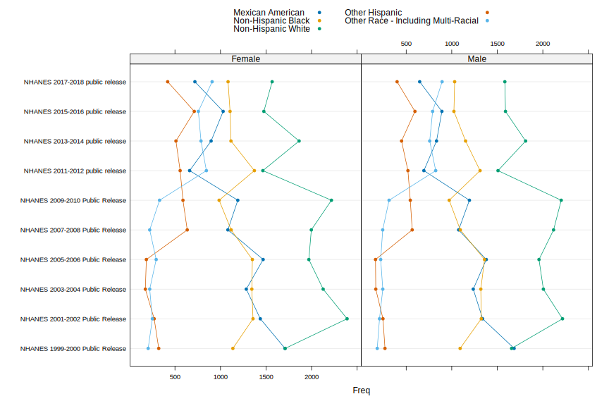

Initial Data Exploration of the `nhanesA` Package
================
Deepayan Sarkar

# Summary of available tables

Data in the `nhanesA` package are stored in a SQL Server database. The
database can be queried using the (unexported) `.nhanesQuery()` function
or its public wrapper `phonto::nhanesQuery()`.

``` r
library(nhanesA)
alltables <- nhanesA:::.nhanesQuery("select * from information_schema.tables;")
dim(alltables)
#> [1] 2965    4
head(alltables) |> kable() |> kable_minimal()
```

<table class=" lightable-minimal" style='font-family: "Trebuchet MS", verdana, sans-serif; margin-left: auto; margin-right: auto;'>

<thead>

<tr>

<th style="text-align:left;">

TABLE\_CATALOG

</th>

<th style="text-align:left;">

TABLE\_SCHEMA

</th>

<th style="text-align:left;">

TABLE\_NAME

</th>

<th style="text-align:left;">

TABLE\_TYPE

</th>

</tr>

</thead>

<tbody>

<tr>

<td style="text-align:left;">

NhanesLandingZone

</td>

<td style="text-align:left;">

Raw

</td>

<td style="text-align:left;">

LAB03

</td>

<td style="text-align:left;">

BASE TABLE

</td>

</tr>

<tr>

<td style="text-align:left;">

NhanesLandingZone

</td>

<td style="text-align:left;">

Raw

</td>

<td style="text-align:left;">

BFRPOL\_I

</td>

<td style="text-align:left;">

BASE TABLE

</td>

</tr>

<tr>

<td style="text-align:left;">

NhanesLandingZone

</td>

<td style="text-align:left;">

Raw

</td>

<td style="text-align:left;">

TCHOL\_J

</td>

<td style="text-align:left;">

BASE TABLE

</td>

</tr>

<tr>

<td style="text-align:left;">

NhanesLandingZone

</td>

<td style="text-align:left;">

Raw

</td>

<td style="text-align:left;">

IHG\_E

</td>

<td style="text-align:left;">

BASE TABLE

</td>

</tr>

<tr>

<td style="text-align:left;">

NhanesLandingZone

</td>

<td style="text-align:left;">

Raw

</td>

<td style="text-align:left;">

SMQMEC

</td>

<td style="text-align:left;">

BASE TABLE

</td>

</tr>

<tr>

<td style="text-align:left;">

NhanesLandingZone

</td>

<td style="text-align:left;">

Raw

</td>

<td style="text-align:left;">

GHB\_E

</td>

<td style="text-align:left;">

BASE TABLE

</td>

</tr>

</tbody>

</table>

There are two versions of each table, the raw table with original codes,
and translated versions with codes translated into human-readable
values. In addition, there are some metadata and ontology tables.

``` r
subset(alltables, !(TABLE_SCHEMA %in% c("Raw", "Translated"))) |> 
  kable() |> kable_minimal()
```

<table class=" lightable-minimal" style='font-family: "Trebuchet MS", verdana, sans-serif; margin-left: auto; margin-right: auto;'>

<thead>

<tr>

<th style="text-align:left;">

</th>

<th style="text-align:left;">

TABLE\_CATALOG

</th>

<th style="text-align:left;">

TABLE\_SCHEMA

</th>

<th style="text-align:left;">

TABLE\_NAME

</th>

<th style="text-align:left;">

TABLE\_TYPE

</th>

</tr>

</thead>

<tbody>

<tr>

<td style="text-align:left;">

2955

</td>

<td style="text-align:left;">

NhanesLandingZone

</td>

<td style="text-align:left;">

Metadata

</td>

<td style="text-align:left;">

QuestionnaireVariables

</td>

<td style="text-align:left;">

BASE TABLE

</td>

</tr>

<tr>

<td style="text-align:left;">

2956

</td>

<td style="text-align:left;">

NhanesLandingZone

</td>

<td style="text-align:left;">

Metadata

</td>

<td style="text-align:left;">

DownloadErrors

</td>

<td style="text-align:left;">

BASE TABLE

</td>

</tr>

<tr>

<td style="text-align:left;">

2957

</td>

<td style="text-align:left;">

NhanesLandingZone

</td>

<td style="text-align:left;">

Metadata

</td>

<td style="text-align:left;">

VariableCodebook

</td>

<td style="text-align:left;">

BASE TABLE

</td>

</tr>

<tr>

<td style="text-align:left;">

2958

</td>

<td style="text-align:left;">

NhanesLandingZone

</td>

<td style="text-align:left;">

Metadata

</td>

<td style="text-align:left;">

ExcludedTables

</td>

<td style="text-align:left;">

BASE TABLE

</td>

</tr>

<tr>

<td style="text-align:left;">

2959

</td>

<td style="text-align:left;">

NhanesLandingZone

</td>

<td style="text-align:left;">

Metadata

</td>

<td style="text-align:left;">

QuestionnaireDescriptions

</td>

<td style="text-align:left;">

BASE TABLE

</td>

</tr>

<tr>

<td style="text-align:left;">

2960

</td>

<td style="text-align:left;">

NhanesLandingZone

</td>

<td style="text-align:left;">

Ontology

</td>

<td style="text-align:left;">

dbxrefs

</td>

<td style="text-align:left;">

BASE TABLE

</td>

</tr>

<tr>

<td style="text-align:left;">

2961

</td>

<td style="text-align:left;">

NhanesLandingZone

</td>

<td style="text-align:left;">

Ontology

</td>

<td style="text-align:left;">

edges

</td>

<td style="text-align:left;">

BASE TABLE

</td>

</tr>

<tr>

<td style="text-align:left;">

2962

</td>

<td style="text-align:left;">

NhanesLandingZone

</td>

<td style="text-align:left;">

Ontology

</td>

<td style="text-align:left;">

entailed\_edges

</td>

<td style="text-align:left;">

BASE TABLE

</td>

</tr>

<tr>

<td style="text-align:left;">

2963

</td>

<td style="text-align:left;">

NhanesLandingZone

</td>

<td style="text-align:left;">

Ontology

</td>

<td style="text-align:left;">

labels

</td>

<td style="text-align:left;">

BASE TABLE

</td>

</tr>

<tr>

<td style="text-align:left;">

2964

</td>

<td style="text-align:left;">

NhanesLandingZone

</td>

<td style="text-align:left;">

Ontology

</td>

<td style="text-align:left;">

synonyms

</td>

<td style="text-align:left;">

BASE TABLE

</td>

</tr>

<tr>

<td style="text-align:left;">

2965

</td>

<td style="text-align:left;">

NhanesLandingZone

</td>

<td style="text-align:left;">

Ontology

</td>

<td style="text-align:left;">

nhanes\_variables\_mappings

</td>

<td style="text-align:left;">

BASE TABLE

</td>

</tr>

</tbody>

</table>

The translated table names can be extracted as follows.

``` r
trtables <- subset(alltables, TABLE_SCHEMA == "Translated")$TABLE_NAME |> sort()
str(trtables)
#>  chr [1:1477] "AA_H" "AAS_H" "ACQ" "ACQ_B" "ACQ_C" "ACQ_D" "ACQ_E" "ACQ_F" "ACQ_G" "ACQ_H" ...
```

Many of these start with `P_`; we will skip them (they represent
releases made during the pandemic, and are inconsistent with previous
releases). The remaining tables often have suffixes (separated by
underscore) that indicate cycle, but may also have underscores in the
main table name.

``` r
std_tables <- trtables[!grepl("^P_", trtables)]
std_tables_split <- strsplit(std_tables, "_", fixed = TRUE)
std_tables[ sapply(std_tables_split, length) == 3 ]
#>  [1] "AL_IGE_D" "ALB_CR_D" "ALB_CR_E" "ALB_CR_F" "ALB_CR_G" "ALB_CR_H" "ALB_CR_I" "ALB_CR_J"
#>  [9] "DXX_2_B"  "HEPB_S_D" "HEPB_S_E" "HEPB_S_F" "HEPB_S_G" "HEPB_S_H" "HEPB_S_I" "HEPB_S_J"
#> [17] "KIQ_P_B"  "KIQ_P_C"  "KIQ_P_D"  "KIQ_P_E"  "KIQ_U_B"  "KIQ_U_C"  "KIQ_U_D"  "KIQ_U_E" 
#> [25] "KIQ_U_F"  "KIQ_U_G"  "KIQ_U_H"  "KIQ_U_I"  "KIQ_U_J"  "L06_2_B"  "L10_2_B"  "L11_2_B" 
#> [33] "L11P_2_B" "L13_2_B"  "L16_2_B"  "L19_2_B"  "L25_2_B"  "L39_2_B"  "L40_2_B"  "RXQ_RX_B"
#> [41] "RXQ_RX_C" "RXQ_RX_D" "RXQ_RX_E" "RXQ_RX_F" "RXQ_RX_G" "RXQ_RX_H" "RXQ_RX_I" "RXQ_RX_J"
#> [49] "VIT_2_B"  "VIT_B6_D" "VIT_B6_E" "VIT_B6_F"
```

We will assume that suffixes `_A`, `_B`, …, `_J` indicate cycles. Then
valid table names are

``` r
drop_table_suffix(std_tables) |> table() |> sort(decreasing = TRUE) |> head(100)
#> 
#>    ACQ    ALQ    BMX    BPQ    BPX    CDQ    DBQ   DEMO    DIQ    DUQ    ECQ    FSQ    HIQ    HOQ 
#>     10     10     10     10     10     10     10     10     10     10     10     10     10     10 
#>    HSQ    HUQ    IMQ    MCQ    OCQ    OHQ    PAQ    PFQ    RHQ RXQ_RX    SMQ SMQFAM    WHQ    AUQ 
#>     10     10     10     10     10     10     10     10     10     10     10     10     10      9 
#>  AUXAR AUXTYM    DEQ  KIQ_U    SXQ    AUX DR1IFF DR1TOT DR2IFF DR2TOT DRXFCD OHXREF    OSQ ALB_CR 
#>      9      9      9      9      9      8      8      8      8      8      8      8      8      7 
#> BIOPRO    CBC    DPQ FASTQX FOLATE    GHB    GLU    HDL   HEPA HEPB_S  HEPBD   HEPC    HIV OHXDEN 
#>      7      7      7      7      7      7      7      7      7      7      7      7      7      7 
#>   PBCD  PERNT PHTHTE PUQMEC    RDQ    SLQ SMQRTU  TCHOL TRIGLY    UAS UCPREG    UHG    UIO  VOCWB 
#>      7      7      7      7      7      7      7      7      7      7      7      7      7      7 
#> WHQMEC BFRPOL    CBQ DS1IDS DS1TOT DS2IDS DS2TOT DSQIDS DSQTOT  DXXAG    HCQ HPVSWR    HSV    INQ 
#>      7      6      6      6      6      6      6      6      6      6      6      6      6      6 
#>   OGTT    PAH PCBPOL POOLTF PSTPOL   APOB   DEET DRXMCD DXXFEM DXXSPN FERTIN FOLFMS   HEPE    OPD 
#>      6      6      6      6      6      5      5      5      5      5      5      5      5      5 
#>   SSKL    SSQ 
#>      5      5
```

Some appear only once or twice. These are probably introduced later, and
were not necessarily continued; for example, the following two tables
relate to air quality.

``` r
std_tables[startsWith(std_tables, "AQQ")]
#> [1] "AQQ_E" "AQQ_F"
nhanesCodebook('AQQ_E') |> lapply("[[", "SAS Label:") |> str()
#> List of 14
#>  $ SEQN   : chr "Respondent sequence number"
#>  $ PAQ685 : chr "Bad air quality change activities"
#>  $ PAQ690A: chr "Wore a mask"
#>  $ PAQ690B: chr "Spent less time outdoors"
#>  $ PAQ690C: chr "Avoided roads that have heavy traffic"
#>  $ PAQ690D: chr "Did less strenuous activities"
#>  $ PAQ690E: chr "Took medication"
#>  $ PAQ690F: chr "Closed windows of your house"
#>  $ PAQ690G: chr "Drove my car less"
#>  $ PAQ690H: chr "Canceled outdoor activities"
#>  $ PAQ690I: chr "Exercised indoors instead of outdoors"
#>  $ PAQ690J: chr "Used buses trains or subways"
#>  $ PAQ690K: chr "Use or change air filter/air cleaner"
#>  $ PAQ690O: chr "Other"
```

# Using metadata tables to obtain table information

Alternatively, we can get information about available tables from the
metadata tables, although for some reason, these do not include the
`P_*` tables.

``` r
tableDesc <- nhanesA:::.nhanesQuery("select * from Metadata.QuestionnaireDescriptions")
tableDesc <- within(tableDesc, TableBase <- drop_table_suffix(TableName))
str(tableDesc)
#> 'data.frame':    1348 obs. of  10 variables:
#>  $ Description   : chr  "Acculturation" "Acculturation" "Acculturation" "Acculturation" ...
#>  $ TableName     : chr  "ACQ" "ACQ_D" "ACQ_E" "ACQ_F" ...
#>  $ BeginYear     : int  1999 2005 2007 2009 2011 2013 2015 2017 2005 2013 ...
#>  $ EndYear       : int  2000 2006 2008 2010 2012 2014 2016 2018 2006 2014 ...
#>  $ DataGroup     : chr  "Questionnaire" "Questionnaire" "Questionnaire" "Questionnaire" ...
#>  $ UseConstraints: chr  "None" "None" "None" "None" ...
#>  $ DocFile       : chr  "https://wwwn.cdc.gov/Nchs/Nhanes/1999-2000/ACQ.htm" "https://wwwn.cdc.gov/Nchs/Nhanes/2005-2006/ACQ_D.htm" "https://wwwn.cdc.gov/Nchs/Nhanes/2007-2008/ACQ_E.htm" "https://wwwn.cdc.gov/Nchs/Nhanes/2009-2010/ACQ_F.htm" ...
#>  $ DataFile      : chr  "https://wwwn.cdc.gov/Nchs/Nhanes/1999-2000/ACQ.XPT" "https://wwwn.cdc.gov/Nchs/Nhanes/2005-2006/ACQ_D.XPT" "https://wwwn.cdc.gov/Nchs/Nhanes/2007-2008/ACQ_E.XPT" "https://wwwn.cdc.gov/Nchs/Nhanes/2009-2010/ACQ_F.XPT" ...
#>  $ DatePublished : chr  "June 2002" "March 2008" "September 2009" "August 2012" ...
#>  $ TableBase     : chr  "ACQ" "ACQ" "ACQ" "ACQ" ...
```

We will work with this from now on. We can summarize this table by table
/ questionnaire descriptions as follows.

``` r
tableSummary <- 
  xtabs(~ TableBase + Description + DataGroup, tableDesc) |> 
  as.data.frame.table() |> subset(Freq > 0)
datatable(tableSummary)
#> PhantomJS not found. You can install it with webshot::install_phantomjs(). If it is installed, please make sure the phantomjs executable can be found via the PATH variable.
```

<div id="htmlwidget-706082be08eefc960a4d" style="width:100%;height:auto;" class="datatables html-widget"></div>
<script type="application/json" data-for="htmlwidget-706082be08eefc960a4d">{"x":{"filter":"none","vertical":false,"data":[["42234","42660","225000","225421","225849","226280","226700","227128","227555","227983","228421","228837","229265","229690","230118","230549","230971","230973","231398","231400","231827","232254","256145","256572","372767","373621","373622","374049","374476","374903","375329","377036","377466","377895","378322","379171","386013","404336","414588","415015","415447","415865","416292","416719","417146","417573","418000","418427","418854","419281","419708","420135","420562","420989","421416","421843","422270","422697","423124","423551","423957","424384","428239","433791","465022","465445","465446","465873","475678","476100","479952","480379","481220","481647","482074","482075","482502","482503","482930","483357","483784","499556","499983","500410","514068","518761","520627","527760","527762","530360","542311","542469","542736","543470","544008","544196","544244","545287","545714","546137","546567","548157","548628","548702","549115","549542","550351","550798","551225","551631","552058","552275","552483","552910","554186","556687","557104","557423","560828","561069","561791","561947","562133","562507","562933","563360","563770","563885","564193","564257","564620","565163","565337","566052","566479","567759","567994","568420","568846","569329","569377","569518","569944","570370","570796","571215","571457","571506","571884","572509","572596","573433","573859","574026","574072","574285","574879","576434","576854","576977","577281","577706","578475","578902","579295","579981","580455","581393","581819","582244","582391","582827","583253","583950","594053","594057","594096","605882","605972","606308","606956","607162","607270","607271","607698","608015","608442","609296","609474","609939","610147","610575","611062","611644","611864","612498","612924","613135","613836","613988","614842","615268","615746","616121","616547","617183","618678","619105","619534","619588","619641","620015","620593","621019","622097","622523","622551","622950","622976","623401","623468","623803","624229","624655","625080","626132","626560","626786","627212","627638","628065","628491","629118","629355","629385","629438","629760","630187","630631","631057","631476","631902","631924","631989","632319","633801","634035","634543","634887","635314","635870","636164","636662","637020","637446","637871","638298","638367","638720","639341","640437","640885","641104","641248","641674","641781","643177","643495","643885","643933","644399","644825","645251","646928","647291","647340","647718","648716","650751","651083","651534","651751","651936","652380","652440","652604","652607","653031","653034","653274","653743","654085","655107","655538","655960","657239","657721","657954","658521","658884","659310","659797","661416","664766","664835","665261","665804","666567","666857","667542","667831","668258","668742","669111","669537","669601","670025","670389","670877","671302","671730","671913","672587","673116","673713","673714","673757","673911","674135","674231","674716","674995","675512","675938","676264","676358","676784","677210","677696","678061","678487","681777","681897","682157","682583","683064","683116","683661","684010","684370","684436","684647","685073","685714","686061","686152","686584","687101","687107","688606","689032","689142","689883","690524","690950","691376","692612","693039","693428","693912","698601","699028","699521","699715","700162","700568","700987","701998","702412","702700","702719","703280","703705","704135","704562","704800","705226","705823","706249","706685","707112","707525","707967","708810","709254","709685","710084","710512","711176","711222","711408","711832","711870","712261","712499","712685","712880","713108","713541","713968","714384","714811","715197","715623","716101","716274","716338","716700","717378","717803","718058","718657","719082","719507","719936","720361","720788","722499","724215","725062","725489","727612","728342","728344","733588","734868","738283","739994","740842","747671","753636","755762","756189","756616","760032","761414","765583","766011","766432","774958","775406","786078","798879","801875","802300","806126","813388","813805","820207","820634","822766","823194","828827","829465","829467","829914","830318","830746","830747","835221","840761","842467","846741","853582","853583","859523","859950","860377","862091","868071","868499","868775","870193","872329","872754","874949","875743","876172","876596","877022","877449","877877","878304","878772","881874","889009","891603","901839","902265","902692","903119"],["DEMO","DEMO","DRXIFF","DR1IFF","DR2IFF","DRXTOT","DR1TOT","DR2TOT","DRXFCD","DRXMCD","DTQ","DS1IDS","DS2IDS","DS1TOT","DS2TOT","DSQIDS","DSQ1","DSQFILE1","DSQ2","DSQFILE2","DSQIDS","DSQTOT","FFQDC","FFQRAW","ARX","AUX","AUX1","AUXAR","AUXTYM","AUXWBR","AUXWBR","BAX","BIX","BPX","BPXO","BMX","CVX","DEX","DXXAG","DXXFEM","DXXSPN","DXXAAC","DXXAG","DXXFEM","DXXFRX","DXXL1","DXXL2","DXXL3","DXXL4","DXXSPN","DXXT10","DXXT11","DXXT12","DXXT4","DXXT5","DXXT6","DXXT7","DXXT8","DXXT9","DXXVFA","DXX","DXX_2","ENX","FLXCLN","LUX","LEXAB","LEXABPI","LEXPN","MSX","MGX","OPXFDT","OPXRET","OHX","OHXADD","OHXDEN","OHXDENT","OHXPER","OHXPERIO","OHXPRL","OHXPRU","OHXREF","PAXDAY","PAXHD","PAXHR","SEQ","SPX","CSX","TB","TBX","VIX","AMDGYD","L06AGE","AMDGDS","SSAFB","ALB_CR","L16","LAB16","ALD","ALDS","AL_IGE","ALDUST","SSAMH","SSTOCA","APOB","AA","AAS","UADM","UTAS","UTASS","UAS","UASS","L06UAS","UAS","UASS","UAM","SSDFS","SSANA2","L34","L28PBE","BFRPOL","SSBFR","CRP","LAB11","L11","L11","L11_2","L06BMT","PBCD","L06","LAB06","L06_2","PBCD","CAFE","SSCA","SSCGA","SSCLTY","HDL","HDL","HDL","L13AM","LAB13AM","TRIGLY","TRIGLY","TRIGLY","TRIGLY","TCHOL","L13","LAB13","L13_2","UCM","CRCO","CBC","CBC","L25","LAB25","CBC","L25_2","CUSEZN","COT","L06COT","COTNAL","COT","UCOT","UCOTS","SSQFEV","L16_2","LAB17","SSCYST","SSCYST","SSCMV","CMV","DEET","DEET","SSDEET","L28DFP","L28POC","LAB28POC","EPH","L24EPH","EPH","SSEBV","EPP","L39","L39_2","L39EPP","ETHOX","ETHOXS","FASTQX","PH","SSFA","FAS","FERTIN","L06TFR","SSFLRT","FR","SSFR","SSFR","FLDEP","UFLDE","FLDEW","FOLATE","FOLATE","L06NB","FOLFMS","FOLFMS","SSFOL","FORMAL","FORMAS","GHB","L10","LAB10","L10_2","SSGLYP","SSGLYP","HEPA","HEPA","L02HPA","HEPB_S","L02HBS","L02","LAB02","HEPBD","HEPBD","HEPBD","HEPB_S","SSHCVR","SSHEPC","HEPC","HEPC","HEPC","HEPE","HEPE","SSHSV1","HSV","L09","LAB09","HCAA","HCAAS","HSCRP","HSCRP","HIV","HIV","L03","LAB03","HCY","SSHE4","HPVSER","L52SER","HPVSER","HPVSRM","ORHPV","HPVP","L37SWA","HPVSWR","HPVSWR","HPVSWC","HPVSWR","L37SWR","HPVP","SSHPV","INS","L06UIO","UIO","FETIB","FETIB","L40FE","SSKL","LAB07","L20","LAB20","PBCD","PBCD","PBCD","MMRV","L19","LAB19","L19_2","SSMEL","LAB22","IHG","L06UHG","UHG","IHGEM","L06HM","LAB06HM","UHM","UM","UHMS","UMS","L35","MMA","L06MH","SSMHHT","SSOL","SSMUMP","SSNEON","UNI","L28NPB","SSPCB","PCBPOL","PCBPOL","SSNORO","OGTT","L26OPD","OPD","OPD","UCOSMO","PTH","L04PER","WPIN","PERNT","PERNTS","SSNO3P","PFAS","PFAS","SSPFSU","SSPFAS","PFAS","SSPFAS","SSPFAC","SSPFC","EPHPP","SSPT","CARB","L26PP","L26UPP","LAB26PP","UPP","L24PP","PP","SSPST","L28OCP","PSTPOL","PSTPOL","L24PH","PHTHTE","PHTHTE","PHTHTE","SSPHTE","PHPYPA","PHPYPA","L06PHY","PHYTO","GLU","GLU","L10AM","LAB10AM","SSPOLI","PAH","L31PAH","PAH","DOXPOL","DOXPOL","PAH","L24PFC","PFC","POOLTF","UC","UCPREG","L11PSA","L11PSA","PSA","L11P_2","UPHOPM","UPHOPM","UPHOPM","SSSAL","SSSNFL","SSCHL","TST","UAS","UASS","BIOPRO","L40","LAB18","L40_2","L36","TELO","SSTERP","L40T4","LAB18T4","THYROD","TGEMA","TSNA","TST","L17","L17","SSTOXO","SSTOXO","TFA","TFR","SSTFR","TRICH","TB","UCFLOW","UCPREG","SSUSG","SSVARI","L06VIT","L45VIT","VITAEC","VIT_2","B12","VITB12","L43","VIT_B6","L06VIT","VIC","VNA","VNAS","UVOC","UVOCS","SSUVOC","SSUVOC","VOCWB","L04VOC","LAB04","L04VOC","VOCMWB","VOC","LAB21","VOCWB","VOCMWB","VOC","VOCWBS","VOCWB","VOCWBS","ACQ","AQQ","ALQ","ALQY","AGQ","RXQ_ANA","RXQANA","ARQ","AUQ","BAQ","BPQ","BHQ","CDQ","CFQ","CBQ","CBQPFA","CBQPFC","CKQ","HSQ","DEQ","DIQ","DBQ","DLQ","DUQ","ECQ","FSQ","HIQ","HEQ","HCQ","HUQ","HOQ","IMQ","INQ","KIQ","KIQ_U","MCQ","CIQDEP","CIQMDEP","DPQ","CIQGAD","CIQPAN","CIQPANIC","MPQ","OCQ","OHQ","OSQ","PUQ","PUQMEC","PAQ","PAQIAF","PAQY","PFQ","RXQ_RX","RXQASA","KIQ_P","PSQ","RHQ","RDQ","SXQ","SLQ","SMQMEC","SMQ","SMQ","SMQFAM","SMQRTU","SMQSHS","SSQ","CSQ","TBQ","VIQ","VTQ","VTQ","WHQ","WHQMEC"],["Demographic Variables &amp; Sample Weights","Demographic Variables and Sample Weights","Dietary Interview - Individual Foods","Dietary Interview - Individual Foods, First Day","Dietary Interview - Individual Foods, Second Day","Dietary Interview - Total Nutrient Intakes","Dietary Interview - Total Nutrient Intakes, First Day","Dietary Interview - Total Nutrient Intakes, Second Day","Dietary Interview Technical Support File - Food Codes","Dietary Interview Technical Support File - Modification Codes","Dietary Screener Questionnaire","Dietary Supplement Use 24-Hour - Individual Dietary Supplements, First Day","Dietary Supplement Use 24-Hour - Individual Dietary Supplements, Second Day","Dietary Supplement Use 24-Hour - Total Dietary Supplements, First Day","Dietary Supplement Use 24-Hour - Total Dietary Supplements, Second Day","Dietary Supplement Use 30 Day - Individual Dietary Supplements","Dietary Supplement Use 30-Day - File 1, Supplement Counts","Dietary Supplement Use 30-Day - File 1, Supplement Counts","Dietary Supplement Use 30-Day - File 2, Participant's Use of Supplements","Dietary Supplement Use 30-Day - File 2, Participant's Use of Supplements","Dietary Supplement Use 30-Day - Individual Dietary Supplements","Dietary Supplement Use 30-Day - Total Dietary Supplements","Food Frequency Questionnaire - Output from DietCalc Software","Food Frequency Questionnaire - Raw Questionnaire Responses","Arthritis Body Measures","Audiometry","Audiometry","Audiometry - Acoustic Reflex","Audiometry - Tympanometry","Audiometry - Wideband Reflectance","Audiometry GÇô Wideband Reflectance","Balance","Bioelectrical Impedance Analysis","Blood Pressure","Blood Pressure - Oscillometric Measurements","Body Measures","Cardiovascular Fitness","Dermatology","Dual Energy X-ray Absorptiometry - Android/Gynoid","Dual Energy X-ray Absorptiometry - Femur","Dual Energy X-ray Absorptiometry - Spine","Dual-Energy X-ray Absorptiometry - Abdominal Aortic Calcification","Dual-Energy X-ray Absorptiometry - Android/Gynoid Measurements","Dual-Energy X-ray Absorptiometry - Femur","Dual-Energy X-ray Absorptiometry - FRAX Score","Dual-Energy X-ray Absorptiometry - L1 Vertebrae Morphology","Dual-Energy X-ray Absorptiometry - L2 Vertebrae Morphology","Dual-Energy X-ray Absorptiometry - L3 Vertebrae Morphology","Dual-Energy X-ray Absorptiometry - L4 Vertebrae Morphology","Dual-Energy X-ray Absorptiometry - Spine","Dual-Energy X-ray Absorptiometry - T10 Vertebrae Morphology","Dual-Energy X-ray Absorptiometry - T11 Vertebrae Morphology","Dual-Energy X-ray Absorptiometry - T12 Vertebrae Morphology","Dual-Energy X-ray Absorptiometry - T4 Vertebrae Morphology","Dual-Energy X-ray Absorptiometry - T5 Vertebrae Morphology","Dual-Energy X-ray Absorptiometry - T6 Vertebrae Morphology","Dual-Energy X-ray Absorptiometry - T7 Vertebrae Morphology","Dual-Energy X-ray Absorptiometry - T8 Vertebrae Morphology","Dual-Energy X-ray Absorptiometry - T9 Vertebrae Morphology","Dual-Energy X-ray Absorptiometry - Vertebral Fracture Assessment","Dual-Energy X-ray Absorptiometry - Whole Body","Dual-Energy X-ray Absorptiometry - Whole Body, Second Exam","Exhaled Nitric Oxide","Fluorosis - Clinical","Liver Ultrasound Transient Elastography","Lower Extremity Disease - Ankle Brachial Blood Pressure Index","Lower Extremity Disease - Ankle Brachial Blood Pressure Index","Lower Extremity Disease - Peripheral Neuropathy","Muscle Strength","Muscle Strength - Grip Test","Ophthalmology - Frequency Doubling Technology","Ophthalmology - Retinal Imaging","Oral Health","Oral Health - Addendum","Oral Health - Dentition","Oral Health - Dentition","Oral Health - Periodontal","Oral Health - Periodontal","Oral Health - Periodontal/Lower","Oral Health - Periodontal/Upper","Oral Health - Recommendation of Care","Physical Activity Monitor - Day","Physical Activity Monitor - Header","Physical Activity Monitor - Hour","Shared Exclusion Questions","Spirometry - Pre and Post-Bronchodilator","Taste &amp; Smell","Tuberculosis","Tuberculosis","Vision","Acrylamide &amp; Glycidamide","Acrylamide &amp; Glycidamide","Acrylamide &amp; Glycidamide - Special Sample","Aflatoxin B1-lysine - Serum (Surplus)","Albumin &amp; Creatinine - Urine","Albumin &amp; Creatinine - Urine","Albumin &amp; Creatinine - Urine","Aldehydes - Serum","Aldehydes - Serum - Special Sample","Allergen Specific IgE(s) &amp; Total IgE - Serum","Allergens - Household Dust","Anti-Mullerian Hormone (AMH) &amp; Inhibin-B (Surplus)","Antibody to Toxocara spp. (Surplus)","Apolipoprotein B","Aromatic Amines - Urine","Aromatic Amines - Urine - Special Sample","Aromatic Diamines - Urine","Arsenic - Total - Urine","Arsenic - Total - Urine - Special Sample","Arsenics - Speciated - Urine","Arsenics - Speciated - Urine - Special Sample","Arsenics - Total &amp; Speciated - Urine","Arsenics - Total &amp; Speciated - Urine","Arsenics - Total &amp; Speciated - Urine - Special Sample","Atrazine and Metabolites","Autoantibodies - Anti-DFS70 Autoantibody Analyses (Surplus)","Autoantibodies - Immunofluorescence Analyses (Surplus)","Bacterial vaginosis (BV) &amp; Trichomonas vaginalis","Brominated Flame Retardants (BFRs)","Brominated Flame Retardants (BFRs) - Pooled Samples","Brominated Flame Retardants (BFRs) - Pooled Samples (Surplus)","C-Reactive Protein (CRP)","C-Reactive Protein (CRP)","C-Reactive Protein (CRP), Bone Alkaline Phosphatase (BAP) &amp; Parathyroid Hormone (PTH)","C-Reactive protein (CRP), Fibrinogen, Bone Alkaline Phosphatase &amp; Urinary N-telopeptides","C-Reactive Protein &amp; Others, Second Exam","Cadmium, Lead, &amp; Total Mercury - Blood","Cadmium, Lead, &amp; Total Mercury - Blood","Cadmium, Lead, Mercury, Cotinine &amp; Nutritional Biochemistries","Cadmium, Lead, Mercury, Cotinine &amp; Nutritional Biochemistries","Cadmium, Lead, Total Mercury, Ferritin, Serum Folate, RBC Folate, Vitamin B12, Homocysteine, Methylmalonic acid, Cotinine - Bloo","Cadmium, Lead, Total Mercury, Selenium, &amp; Manganese - Blood","Caffeine &amp; Caffeine Metabolites - Urine","Cancer antigen CA125 and CA15.3 - Serum (Surplus)","Cancer antigen CA125, CA15.3 and HE4 IgG antibodies - Serum (Surplus)","Chlorinated Tyrosine GÇô Serum (Surplus)","Cholesterol - HDL","Cholesterol - High - Density Lipoprotein (HDL)","Cholesterol - High-Density Lipoprotein (HDL)","Cholesterol - LDL &amp; Triglycerides","Cholesterol - LDL &amp; Triglycerides","Cholesterol - LDL &amp; Triglycerides","Cholesterol - LDL, Triglyceride &amp; Apoliprotein (ApoB)","Cholesterol - Low - Density Lipoprotein (LDL) &amp; Triglycerides","Cholesterol - Low-Density Lipoproteins (LDL) &amp; Triglycerides","Cholesterol - Total","Cholesterol - Total &amp; HDL","Cholesterol - Total &amp; HDL","Cholesterol - Total, HDL, LDL  &amp; Triglycerides, Second Exam","Chromium - Urine","Chromium &amp; Cobalt","Complete Blood Count with 5-Part Differential","Complete Blood Count with 5-part Differential - Whole Blood","Complete Blood Count with 5-part Differential - Whole Blood","Complete Blood Count with 5-part Differential - Whole Blood","Complete Blood Count with 5-Part Differential - Whole Blood","Complete Blood Count with 5-part Differential - Whole Blood, Second Exam","Copper, Selenium &amp; Zinc - Serum","Cotinine - Serum","Cotinine - Serum","Cotinine - Serum &amp; Total NNAL - Urine","Cotinine and Hydroxycotinine - Serum","Cotinine, Hydroxycotinine, &amp; Other Nicotine Metabolites and Analogs - Urine","Cotinine, Hydroxycotinine, &amp; Other Nicotine Metabolites and Analogs - Urine - Special Sample","Coxiella Burnetii (Q Fever) Antibodies - Serum (Surplus)","Creatinine &amp; Albumin - Urine, Second Exam","Cryptosporidum &amp; Toxoplasma","Cystatin C - Serum (Surplus)","Cystatin C (Surplus)","Cytomegalovirus Antibodies - Serum (Surplus)","Cytomegalovirus IgG &amp; IgM Antibodies - Serum","DEET and Metabolites","DEET Metabolite - Urine","DEET Metabolites - Urine - Surplus","Dioxins, Furans, &amp; Coplanar PCBs","Dioxins, Furans, &amp; Coplanar PCBs","Dioxins, Furans, &amp; Coplanar PCBs","Environmental Phenols","Environmental Phenols","Environmental Phenols &amp; Parabens","Epstein-Barr Virus (VCA IgG) - Serum (Surplus)","Erythrocyte Protoporphyrin","Erythrocyte Protoporphyrin","Erythrocyte Protoporphyrin","Erythrocyte Protoporphyrin &amp; Selenium","Ethylene Oxide","Ethylene Oxide - Special Sample","Fasting Questionnaire","Fasting Questionnaire","Fatty Acids - Plasma (Surplus)","Fatty Acids - Serum","Ferritin","Ferritin &amp; Transferrin Receptor","Flame Retardant Metabolites - Urine (Surplus)","Flame Retardants - Urine","Flame Retardants - Urine  (Surplus)","Flame Retardants - Urine (Surplus)","Fluoride - Plasma","Fluoride - Urine","Fluoride - Water","Folate - RBC","Folate - RBC &amp; Serum","Folate - RBC &amp; Serum, and Vitamin B12","Folate Forms - Individual - Serum","Folate Forms - Total &amp; Individual - Serum","Folic Acid - Unmetabolized (Surplus)","Formaldehyde","Formaldehyde - Special Sample","Glycohemoglobin","Glycohemoglobin","Glycohemoglobin","Glycohemoglobin, Plasma Glucose, Serum C-peptide, &amp; Insulin, Second Exam","Glyphosate (GLYP) - Urine","Glyphosate (GLYP) - Urine (Surplus)","Hepatitis A","Hepatitis A Antibody","Hepatitis A Antibody","Hepatitis B Surface Antibody","Hepatitis B Surface Antibody","Hepatitis B: Core Antibody &amp; Surface Antigen; Hepatitis C: Confirmed Antibody &amp; RNA (HCV-RNA); Hepatitis D Antibody","Hepatitis B: Core Antibody &amp; Surface Antigen; Hepatitis C: Confirmed Antibody &amp; RNA (HCV-RNA); Hepatitis D Antibody","Hepatitis B: core antibody, surface antigen, and Hepatitis D antibody","Hepatitis B: Core antibody, Surface antigen, and Hepatitis D antibody","Hepatitis B: Core Antibody, Surface Antigen; Hepatitis D Antibody","Hepatitis B: Surface Antibody","Hepatitis C RNA (HCV-RNA) &amp; HCV Genotype (Surplus)","Hepatitis C: Confirmed Antibody (INNO-LIA)","Hepatitis C: Confirmed Antibody, RNA (HCV-RNA), &amp; Genotype","Hepatitis C: RNA (HCV-RNA) and Hepatitis C Genotype","Hepatitis C: RNA (HCV-RNA), Confirmed Antibody (INNO-LIA), &amp; Genotype","Hepatitis E : IgG &amp; IgM Antibodies","Hepatitis E: IgG &amp; IgM Antibodies","Herpes Simplex Virus Type-1 (Surplus)","Herpes Simplex Virus Type-1 &amp; Type-2","Herpes Simplex Virus Type-1 &amp; Type-2","Herpes Simplex Virus Type-1 &amp; Type-2","Heterocyclic Aromatic Amines - Urine","Heterocyclic Aromatic Amines (HCAA) - Urine - Special Sample","High-Sensitivity C-Reactive Protein","High-Sensitivity C-Reactive Protein (hs-CRP)","HIV Antibody Test","HIV Antibody Test, CD4+ T Lymphocytes &amp; CD8+ T Cells","HIV Antibody Test, CD4+ T Lymphocytes &amp; CD8+ T Cells","HIV Antibody Test, CD4+ T Lymphocytes &amp; CD8+ T Cells","Homocysteine","Human epididymal secretory protein E4 (HE4) - Serum (Surplus)","Human Papillomavirus (HPV) - 6, 11, 16 &amp; 18 Antibody - Serum","Human Papillomavirus (HPV) - 6, 11, 16 &amp; 18 Antibody - Serum: 4-plex CLIA","Human Papillomavirus (HPV) - 6, 11, 16 &amp; 18 Antibody GÇô Serum: 4-plex CLIA","Human Papillomavirus (HPV) - Multiplexed 6, 11, 16, 18, 31, 33, 45, 52 &amp; 58 Antibody GÇô Serum: 9-plex CLIA","Human Papillomavirus (HPV) - Oral Rinse","Human Papillomavirus (HPV) DNA - Penile Swabs: Roche Linear Array","Human Papillomavirus (HPV) DNA - Vaginal Swab: Digene Hybrid Capture &amp; Prototype Line Blot Assay","Human Papillomavirus (HPV) DNA - Vaginal Swab: Digene Hybrid Capture &amp; Roche Linear Array","Human Papillomavirus (HPV) DNA - Vaginal Swab: Roche Cobas &amp; Roche Linear Array","Human Papillomavirus (HPV) DNA - Vaginal Swab: Roche Cobas High-Risk","Human Papillomavirus (HPV) DNA - Vaginal Swab: Roche Linear Array","Human Papillomavirus (HPV) DNA - Vaginal Swab: Roche Linear Array","Human Papillomavirus (HPV) DNA Results from Penile Swab Samples: Roche Linear Array","Human Papillomavirus (HPV) Viral Load - Oral Rinse - Oral High-Risk HPV Infections (Surplus)","Insulin","Iodine - Urine","Iodine - Urine","Iron Status - Serum","Iron, Total Iron Binding Capacity (TIBC), &amp; Transferrin Saturation","Iron, Total Iron Binding Capacity (TIBC), &amp; Transferrin Saturation","Klotho - Serum (Surplus)","Latex","Lead - Dust","Lead - Dust","Lead, Cadmium, Total Mercury, Selenium &amp; Manganese - Blood","Lead, Cadmium, Total Mercury, Selenium, &amp; Manganese - Blood","Lead, Cadmium, Total Mercury, Selenium, and Manganese - Blood","Measles, Mumps, Rubella &amp; Varicella","Measles, Rubella, &amp; Varicella","Measles, Rubella, &amp; Varicella","Measles, Rubella, &amp; Varicella, Second Exam","Melamine - Urine (Surplus)","Mercury - Hair","Mercury: Inorganic - Blood","Mercury: Inorganic - Urine","Mercury: Inorganic - Urine","Mercury: Inorganic, Ethyl and Methyl - Blood","Metals - Urine","Metals - Urine","Metals - Urine","Metals - Urine","Metals - Urine - Special Sample","Metals - Urine - Special Sample","Methicillin - Resistant Staphylococcus aureus (MRSA)","Methylmalonic Acid","Methylmalonic acid &amp; Homocysteine","Mono-2-ethyl-5-hydroxyhexyl terephthalate, mono-2-ethyl-5-carboxypentyl terephthalate, and monooxoisononyl phthalate - Urine (Su","Monoclonal gammopathy of undetermined significance (MGUS) (Surplus)","Mumps Antibody - Serum (Surplus)","Neonicotinoids - Urine - Surplus","Nickel - Urine","Non-dioxin-like Polychlorinated Biphenyls","Non-dioxin-like Polychlorinated Biphenyls - Pooled Samples (Surplus Sera)","Non-dioxin-like Polychlorinated Biphenyls &amp; Mono-ortho-substituted Polychlorinated Biphenyls - Pooled Samples","Non-dioxin-like Polychlorinated Biphenyls &amp; Mono-ortho-substituted Polychlorinated Biphenyls - Serum - Pooled Samples","Norovirus antibody - Serum","Oral Glucose Tolerance Test","Organophosphate Insecticides - Diakyl Phosphate Metabolites - Urine","Organophosphate Insecticides - Diakyl Phosphate Metabolites - Urine","Organophosphate Insecticides - Dialkyl Phosphate Metabolites - Urine","Osmolality - Urine","Parathyroid Hormone","Perchlorate - Urine","Perchlorate, Nitrate &amp; Iodide - Tap Water","Perchlorate, Nitrate &amp; Thiocyanate - Urine","Perchlorate, Nitrate &amp; Thiocyanate - Urine - Special Sample","Perchlorate, Nitrate &amp; Thiocyanate - Urine (Surplus)","Perfluoroalkyl and Polyfluoroalkyl","Perfluoroalkyl and Polyfluoroalkyl Substances","Perfluoroalkyl and Polyfluoroalkyl Substances","Perfluoroalkyl and Polyfluoroalkyl Substances - Linear and Branched PFOS and PFOA Isomers (Surplus)","Perfluoroalkyl and Polyfluoroalkyl Substances (formerly Polyfluoroalkyl Chemicals - PFC)","Perfluoroalkyl and Polyfluoroalkyl Substances (Surplus)","Perfluoroalkyl and Polyfluoroalkyl Substances in US children 3-11 Years of Age","Perfluoroalkyl Chemicals - Serum (Surplus)","Personal Care and Consumer Product Chemicals and Metabolites","Pertussis and tetanus GÇô Serum (Surplus)","Pesticides - Carbamates &amp; Organophosphorus Metabolites - Urine","Pesticides - Current Use - Urine (Formerly Priority Pesticides, Non-persistent Pesticide Metabolites)","Pesticides - Current Use - Urine (Formerly Priority Pesticides, Non-persistent Pesticide Metabolites)","Pesticides - Current Use - Urine (Formerly Priority Pesticides, Non-persistent Pesticide Metabolites)","Pesticides - Current Use - Urine (Formerly Priority Pesticides, Non-persistent Pesticide Metabolites)","Pesticides - Environmental - Urine","Pesticides - Environmental - Urine","Pesticides - Organochlorine Metabolites - Serum - Pooled Samples (Surplus)","Pesticides - Organochlorine Metabolites - Serum (Surplus)","Pesticides - Organochlorine Pesticides - Pooled Samples","Pesticides - Organochlorine Pesticides - Serum - Pooled Samples","Phthalates - Urine","Phthalates - Urine","Phthalates &amp; Plasticizers Metabolites - Urine","Phthalates and Plasticizers Metabolites - Urine","Phthalates and Plasticizers Metabolites - Urine (Surplus)","Phthalates, Phytoestrogens &amp; PAHs - Urine","Phthalates, Phytoestrogens &amp; PAHs - Urine PHPYPA Urinary Phthalates","Phytoestrogens - Urine","Phytoestrogens - Urine","Plasma Fasting Glucose","Plasma Fasting Glucose &amp; Insulin","Plasma Fasting Glucose, Serum C-peptide &amp; Insulin","Plasma Fasting Glucose, Serum C-peptide &amp; Insulin","Poliovirus Serotypes 1, 2, &amp; 3 Antibodies - Serum (Surplus)","Polyaromatic Hydrocarbons -Urine","Polyaromatic Hydrocarbons (PAHs) - Urine","Polyaromatic Hydrocarbons (PAHs) - Urine","Polychlorinated dibenzo-p-dioxins (PCDDs), Dibenzofurans (PCDFs) &amp; Coplanar Polychlorinated Biphenyls (cPCBs)  - Pooled Samples","Polychlorinated dibenzo-p-dioxins (PCDDs), Dibenzofurans (PCDFs) &amp; Coplanar Polychlorinated Biphenyls (cPCBs) - Pooled Samples","Polycyclic Aromatic Hydrocarbons (PAH) - Urine","Polyfluoroalkyl Chemicals","Polyfluoroalkyl Chemicals","Pooled-Sample Technical Support File","Pregnancy Test - Urine","Pregnancy Test - Urine","Prostate specific antigen (PSA)","Prostate Specific Antigen (PSA)","Prostate Specific Antigen (PSA)","Prostate-specific Antigen (PSA), Second Exam","Pyrethroids, Herbicides, &amp; OP Metabolites - Urine","Pyrethroids, Herbicides, &amp; Organophosphorus Metabolites","Pyrethroids, Herbicides, &amp; Organophosphorus Metabolites - Urine","Salmonella &amp; Campylobacter Antibodies (Surplus)","Serum Neurofilament Light Chain - Serum","Sex Steroid Hormone - Men (Surplus)","Sex Steroid Hormone - Serum","Speciated Arsenics - Urine","Speciated Arsenics - Urine - Special Sample","Standard Biochemistry Profile","Standard Biochemistry Profile","Standard Biochemistry Profile &amp; Hormones","Standard Biochemistry Profile, Follicle Stimulating Hormone &amp; Luteinizing Hormone, Second Exam","Syphilis-IgG, Syphilis Rapid Plasma Reagin (RPR) &amp; Treponema pallidum Particle Agglutination (TP-PA)","Telomere Mean and Standard Deviation (Surplus)","Terpenes GÇô Serum (Surplus)","Thyroid - Stimulating Hormone &amp; Thyroxine (TSH &amp; T4)","Thyroid - Stimulating Hormone &amp; Thyroxine (TSH &amp; T4)","Thyroid Profile","Tissue Transglutaminase Assay (IgA-TTG) &amp; IgA Endomyseal Antibody Assay (IgA EMA)","Tobacco-specific Nitrosamines (TSNAs) - Urine","Total Testosterone","Toxoplasma (IgG) &amp; Toxoplasma (IgM)","Toxoplasma (IgG), Toxoplasma (IgM),Toxoplasma (Dye),Toxoplasma Differential Agglutination, &amp; Toxoplasma (Avidity)","Toxoplasma gondii Antibody - Serum (Surplus)","Toxoplasma Gondii Antibody - Serum (Surplus)","Trans Fatty Acids","Transferrin Receptor","Transferrin Receptor - Pregnant Women (Surplus)","Trichomonas - Urine","Tuberculosis - Quantiferon_In_Gold","Urine Flow Rate","Urine Pregnancy Test","Urine Specific Gravity Measurement (Surplus)","Varicella-Zoster Virus Antibody (Surplus)","Vitamin A, Vitamin E &amp; Carotenoids","Vitamin A, Vitamin E &amp; Carotenoids","Vitamin A, Vitamin E &amp; Carotenoids","Vitamin A, Vitamin E, &amp; Carotenoids, Second Exam","Vitamin B12","Vitamin B12","Vitamin B6","Vitamin B6","Vitamin C","Vitamin C","Volatile N-Nitrosamine Compounds (VNAs) - Urine","Volatile N-Nitrosamine Compounds (VNAs) - Urine - Special Sample","Volatile Organic Compound (VOC) Metabolites - Urine","Volatile Organic Compound (VOC) Metabolites - Urine - Special Sample","Volatile Organic Compound (VOC) Metabolites - Urine (Surplus)","Volatile Organic Compound (VOC) Metabolites II - Urine (Surplus)","Volatile Organic Compounds - Blood &amp; Related Questionnaire Items","Volatile Organic Compounds - Blood &amp; Water","Volatile Organic Compounds - Blood &amp; Water","Volatile Organic Compounds - Blood, Water, &amp; Related Questionnaire Items","Volatile Organic Compounds - Trihalomethanes/MTBE/Nitromethane - Blood","Volatile Organic Compounds - Water &amp; Related Questionnaire Items","Volatile Organic Compounds (VOC) - Personal Exposure Badge","Volatile Organic Compounds (VOCs) - Blood","Volatile Organic Compounds (VOCs) - Trihalomethanes/MTBE/Nitromethane - Blood","Volatile Organic Compounds (VOCs) - Water","Volatile Organic Compounds (VOCs) and Trihalomethanes/MTBE - Blood - Special Sample","Volatile Organic Compounds and Trihalomethanes/MTBE - Blood","Volatile Organic Compounds and Trihalomethanes/MTBE GÇô Blood GÇô Special Sample","Acculturation","Air Quality","Alcohol Use","Alcohol Use (Ages 18-19)","Allergy","Analgesic Pain Relievers","Analgesic Pain Relievers","Arthritis","Audiometry","Balance","Blood Pressure &amp; Cholesterol","Bowel Health","Cardiovascular Health","Cognitive Functioning","Consumer Behavior","Consumer Behavior Phone Follow-up Module - Adult","Consumer Behavior Phone Follow-up Module - Child","Creatine Kinase","Current Health Status","Dermatology","Diabetes","Diet Behavior &amp; Nutrition","Disability","Drug Use","Early Childhood","Food Security","Health Insurance","Hepatitis","Hepatitis C Follow Up","Hospital Utilization &amp; Access to Care","Housing Characteristics","Immunization","Income","Kidney Conditions","Kidney Conditions - Urology","Medical Conditions","Mental Health - Depression","Mental Health - Depression","Mental Health - Depression Screener","Mental Health - Generalized Anxiety Disorder","Mental Health - Panic Disorder","Mental Health - Panic Disorder","Miscellaneous Pain","Occupation","Oral Health","Osteoporosis","Pesticide Use","Pesticide Use","Physical Activity","Physical Activity - Individual Activities","Physical Activity - Youth","Physical Functioning","Prescription Medications","Preventive Aspirin Use","Prostate Conditions","Prostate Specific Antigen Follow-up","Reproductive Health","Respiratory Health","Sexual Behavior","Sleep Disorders","Smoking - Adult Recent Tobacco Use &amp; Youth Cigarette/Tobacco Use","Smoking - Cigarette Use","Smoking - Cigarette/Tobacco Use - Adult","Smoking - Household Smokers","Smoking - Recent Tobacco Use","Smoking - Secondhand Smoke Exposure","Social Support","Taste &amp; Smell","Tuberculosis","Vision","Volatile Toxicant","Volatile Toxicant (Subsample)","Weight History","Weight History - Youth"],["Demographics","Demographics","Dietary","Dietary","Dietary","Dietary","Dietary","Dietary","Dietary","Dietary","Dietary","Dietary","Dietary","Dietary","Dietary","Dietary","Dietary","Dietary","Dietary","Dietary","Dietary","Dietary","Dietary","Dietary","Examination","Examination","Examination","Examination","Examination","Examination","Examination","Examination","Examination","Examination","Examination","Examination","Examination","Examination","Examination","Examination","Examination","Examination","Examination","Examination","Examination","Examination","Examination","Examination","Examination","Examination","Examination","Examination","Examination","Examination","Examination","Examination","Examination","Examination","Examination","Examination","Examination","Examination","Examination","Examination","Examination","Examination","Examination","Examination","Examination","Examination","Examination","Examination","Examination","Examination","Examination","Examination","Examination","Examination","Examination","Examination","Examination","Examination","Examination","Examination","Examination","Examination","Examination","Examination","Examination","Examination","Laboratory","Laboratory","Laboratory","Laboratory","Laboratory","Laboratory","Laboratory","Laboratory","Laboratory","Laboratory","Laboratory","Laboratory","Laboratory","Laboratory","Laboratory","Laboratory","Laboratory","Laboratory","Laboratory","Laboratory","Laboratory","Laboratory","Laboratory","Laboratory","Laboratory","Laboratory","Laboratory","Laboratory","Laboratory","Laboratory","Laboratory","Laboratory","Laboratory","Laboratory","Laboratory","Laboratory","Laboratory","Laboratory","Laboratory","Laboratory","Laboratory","Laboratory","Laboratory","Laboratory","Laboratory","Laboratory","Laboratory","Laboratory","Laboratory","Laboratory","Laboratory","Laboratory","Laboratory","Laboratory","Laboratory","Laboratory","Laboratory","Laboratory","Laboratory","Laboratory","Laboratory","Laboratory","Laboratory","Laboratory","Laboratory","Laboratory","Laboratory","Laboratory","Laboratory","Laboratory","Laboratory","Laboratory","Laboratory","Laboratory","Laboratory","Laboratory","Laboratory","Laboratory","Laboratory","Laboratory","Laboratory","Laboratory","Laboratory","Laboratory","Laboratory","Laboratory","Laboratory","Laboratory","Laboratory","Laboratory","Laboratory","Laboratory","Laboratory","Laboratory","Laboratory","Laboratory","Laboratory","Laboratory","Laboratory","Laboratory","Laboratory","Laboratory","Laboratory","Laboratory","Laboratory","Laboratory","Laboratory","Laboratory","Laboratory","Laboratory","Laboratory","Laboratory","Laboratory","Laboratory","Laboratory","Laboratory","Laboratory","Laboratory","Laboratory","Laboratory","Laboratory","Laboratory","Laboratory","Laboratory","Laboratory","Laboratory","Laboratory","Laboratory","Laboratory","Laboratory","Laboratory","Laboratory","Laboratory","Laboratory","Laboratory","Laboratory","Laboratory","Laboratory","Laboratory","Laboratory","Laboratory","Laboratory","Laboratory","Laboratory","Laboratory","Laboratory","Laboratory","Laboratory","Laboratory","Laboratory","Laboratory","Laboratory","Laboratory","Laboratory","Laboratory","Laboratory","Laboratory","Laboratory","Laboratory","Laboratory","Laboratory","Laboratory","Laboratory","Laboratory","Laboratory","Laboratory","Laboratory","Laboratory","Laboratory","Laboratory","Laboratory","Laboratory","Laboratory","Laboratory","Laboratory","Laboratory","Laboratory","Laboratory","Laboratory","Laboratory","Laboratory","Laboratory","Laboratory","Laboratory","Laboratory","Laboratory","Laboratory","Laboratory","Laboratory","Laboratory","Laboratory","Laboratory","Laboratory","Laboratory","Laboratory","Laboratory","Laboratory","Laboratory","Laboratory","Laboratory","Laboratory","Laboratory","Laboratory","Laboratory","Laboratory","Laboratory","Laboratory","Laboratory","Laboratory","Laboratory","Laboratory","Laboratory","Laboratory","Laboratory","Laboratory","Laboratory","Laboratory","Laboratory","Laboratory","Laboratory","Laboratory","Laboratory","Laboratory","Laboratory","Laboratory","Laboratory","Laboratory","Laboratory","Laboratory","Laboratory","Laboratory","Laboratory","Laboratory","Laboratory","Laboratory","Laboratory","Laboratory","Laboratory","Laboratory","Laboratory","Laboratory","Laboratory","Laboratory","Laboratory","Laboratory","Laboratory","Laboratory","Laboratory","Laboratory","Laboratory","Laboratory","Laboratory","Laboratory","Laboratory","Laboratory","Laboratory","Laboratory","Laboratory","Laboratory","Laboratory","Laboratory","Laboratory","Laboratory","Laboratory","Laboratory","Laboratory","Laboratory","Laboratory","Laboratory","Laboratory","Laboratory","Laboratory","Laboratory","Laboratory","Laboratory","Laboratory","Laboratory","Laboratory","Laboratory","Laboratory","Laboratory","Laboratory","Laboratory","Laboratory","Laboratory","Laboratory","Laboratory","Laboratory","Laboratory","Laboratory","Laboratory","Laboratory","Laboratory","Laboratory","Laboratory","Laboratory","Laboratory","Laboratory","Laboratory","Laboratory","Laboratory","Laboratory","Laboratory","Laboratory","Laboratory","Laboratory","Laboratory","Laboratory","Laboratory","Laboratory","Laboratory","Laboratory","Laboratory","Laboratory","Laboratory","Laboratory","Laboratory","Laboratory","Laboratory","Laboratory","Laboratory","Laboratory","Laboratory","Laboratory","Laboratory","Laboratory","Laboratory","Laboratory","Laboratory","Laboratory","Laboratory","Laboratory","Laboratory","Laboratory","Laboratory","Laboratory","Laboratory","Questionnaire","Questionnaire","Questionnaire","Questionnaire","Questionnaire","Questionnaire","Questionnaire","Questionnaire","Questionnaire","Questionnaire","Questionnaire","Questionnaire","Questionnaire","Questionnaire","Questionnaire","Questionnaire","Questionnaire","Questionnaire","Questionnaire","Questionnaire","Questionnaire","Questionnaire","Questionnaire","Questionnaire","Questionnaire","Questionnaire","Questionnaire","Questionnaire","Questionnaire","Questionnaire","Questionnaire","Questionnaire","Questionnaire","Questionnaire","Questionnaire","Questionnaire","Questionnaire","Questionnaire","Questionnaire","Questionnaire","Questionnaire","Questionnaire","Questionnaire","Questionnaire","Questionnaire","Questionnaire","Questionnaire","Questionnaire","Questionnaire","Questionnaire","Questionnaire","Questionnaire","Questionnaire","Questionnaire","Questionnaire","Questionnaire","Questionnaire","Questionnaire","Questionnaire","Questionnaire","Questionnaire","Questionnaire","Questionnaire","Questionnaire","Questionnaire","Questionnaire","Questionnaire","Questionnaire","Questionnaire","Questionnaire","Questionnaire","Questionnaire","Questionnaire","Questionnaire"],[7,3,2,8,8,2,8,8,6,5,1,6,6,6,6,3,3,1,3,1,3,6,2,2,1,8,1,9,9,1,1,3,3,10,1,10,3,1,2,3,3,1,4,2,1,1,1,1,1,2,1,1,1,1,1,1,1,1,1,1,4,1,3,4,1,2,1,3,2,2,2,2,2,1,7,1,3,1,2,2,8,2,2,2,1,3,1,1,1,5,3,1,1,1,7,2,1,1,1,1,1,3,2,5,1,1,1,3,2,2,1,1,4,1,1,1,1,2,1,6,1,3,1,1,1,1,1,3,1,1,1,1,3,1,1,1,5,1,1,2,1,4,1,1,1,7,2,1,1,1,2,1,4,2,1,2,1,3,1,1,3,3,3,2,1,1,1,1,1,3,2,4,1,1,1,1,1,2,1,2,4,1,1,1,1,3,1,7,3,1,2,5,1,1,1,1,2,2,1,2,4,3,1,1,4,1,2,1,7,2,1,1,1,1,3,4,3,4,3,2,1,1,2,4,3,1,1,4,2,1,2,3,2,6,2,1,1,1,1,1,6,1,2,1,1,1,1,1,2,1,4,1,1,4,1,1,1,1,1,1,3,2,7,1,1,2,5,1,2,1,1,1,1,1,2,1,1,1,1,3,1,7,4,2,1,4,3,1,2,2,2,1,1,3,3,1,1,1,1,5,1,2,6,1,2,3,2,1,1,1,7,3,1,1,1,1,1,1,1,1,1,2,1,2,1,1,1,2,1,4,1,1,5,1,1,3,1,3,1,1,1,1,3,3,4,2,1,1,1,1,3,1,3,2,1,4,4,3,6,1,1,3,1,2,1,2,1,1,3,2,1,1,7,2,1,1,2,2,1,1,1,3,3,1,1,1,1,2,1,2,5,2,2,1,5,1,1,3,1,1,2,1,1,2,1,3,1,2,1,1,4,3,1,1,2,1,1,1,1,2,1,2,2,1,1,3,1,10,2,10,1,1,1,2,1,9,3,10,3,10,4,6,3,3,2,10,9,10,10,3,10,10,10,10,3,6,10,10,10,6,1,9,10,2,1,7,3,2,1,3,10,10,8,3,7,10,4,1,10,10,4,4,2,10,7,9,7,3,7,3,10,7,3,5,2,2,5,2,3,10,7]],"container":"<table class=\"display\">\n  <thead>\n    <tr>\n      <th> <\/th>\n      <th>TableBase<\/th>\n      <th>Description<\/th>\n      <th>DataGroup<\/th>\n      <th>Freq<\/th>\n    <\/tr>\n  <\/thead>\n<\/table>","options":{"columnDefs":[{"className":"dt-right","targets":4},{"orderable":false,"targets":0}],"order":[],"autoWidth":false,"orderClasses":false}},"evals":[],"jsHooks":[]}</script>

# Miscellaneous oddities

There is a mismatch for tables with base name `SSDFS` (there may be
others as well).

``` r
std_tables[startsWith(std_tables, "SSDFS")]
#> [1] "SSDFS_A" "SSDFS_G"
subset(tableDesc, startsWith(TableName, "SSDFS"))[1:5]
#>                                                    Description TableName BeginYear EndYear
#> 56 Autoantibodies - Anti-DFS70 Autoantibody Analyses (Surplus)   SSDFS_G      2011    2012
#>     DataGroup
#> 56 Laboratory
```

The `SSDFS_A` table does exist:

``` r
str(nhanes('SSDFS_A', translated = TRUE))
#> 'data.frame':    148 obs. of  5 variables:
#>  $ SEQN    : int  255 341 1227 1693 1825 2473 2484 3018 3098 3715 ...
#>  $ WTANA6YR: num  7706 55179 102257 36033 8923 ...
#>  $ SSDFSS  : num  1 1 1 1 1 1 1 1 1 1 ...
#>  $ SSDFSE  : num  3.82 35.31 53.08 47.19 121.8 ...
#>  $ SSDFSR  : num  0 1 1 1 1 0 1 1 1 0 ...
```

However, even though `SSDFS_G` is a legitimate table, there is no
<https://wwwn.cdc.gov/Nchs/Nhanes/2011-2012/SSDFS_A.htm>, and the
corresponding codebook naturally has no useful information. Where did
the `SSDFS_A` table come from?

What is the difference between `includelabels = TRUE` and `FALSE`?
Neither version seems to include the SAS labels

``` r
nhanes('DEMO_G', includelabels = FALSE) |> attributes() |> str()
#> List of 3
#>  $ names    : chr [1:48] "SEQN" "SDDSRVYR" "RIDSTATR" "RIAGENDR" ...
#>  $ class    : chr "data.frame"
#>  $ row.names: int [1:9756] 1 2 3 4 5 6 7 8 9 10 ...
nhanes('DEMO_G', includelabels = TRUE) |> attributes() |> str()
#> List of 3
#>  $ names    : chr [1:48] "SEQN" "SDDSRVYR" "RIDSTATR" "RIAGENDR" ...
#>  $ class    : chr "data.frame"
#>  $ row.names: int [1:9756] 1 2 3 4 5 6 7 8 9 10 ...
```

Consider tables whose description contains “cholesterol”.

``` r
subset(tableSummary, grepl("cholesterol", Description, ignore.case = TRUE)) |> kable()
```

<table>

<thead>

<tr>

<th style="text-align:left;">

</th>

<th style="text-align:left;">

TableBase

</th>

<th style="text-align:left;">

Description

</th>

<th style="text-align:left;">

DataGroup

</th>

<th style="text-align:right;">

Freq

</th>

</tr>

</thead>

<tbody>

<tr>

<td style="text-align:left;">

567994

</td>

<td style="text-align:left;">

HDL

</td>

<td style="text-align:left;">

Cholesterol - HDL

</td>

<td style="text-align:left;">

Laboratory

</td>

<td style="text-align:right;">

5

</td>

</tr>

<tr>

<td style="text-align:left;">

568420

</td>

<td style="text-align:left;">

HDL

</td>

<td style="text-align:left;">

Cholesterol - High - Density Lipoprotein (HDL)

</td>

<td style="text-align:left;">

Laboratory

</td>

<td style="text-align:right;">

1

</td>

</tr>

<tr>

<td style="text-align:left;">

568846

</td>

<td style="text-align:left;">

HDL

</td>

<td style="text-align:left;">

Cholesterol - High-Density Lipoprotein (HDL)

</td>

<td style="text-align:left;">

Laboratory

</td>

<td style="text-align:right;">

1

</td>

</tr>

<tr>

<td style="text-align:left;">

569329

</td>

<td style="text-align:left;">

L13AM

</td>

<td style="text-align:left;">

Cholesterol - LDL & Triglycerides

</td>

<td style="text-align:left;">

Laboratory

</td>

<td style="text-align:right;">

2

</td>

</tr>

<tr>

<td style="text-align:left;">

569377

</td>

<td style="text-align:left;">

LAB13AM

</td>

<td style="text-align:left;">

Cholesterol - LDL & Triglycerides

</td>

<td style="text-align:left;">

Laboratory

</td>

<td style="text-align:right;">

1

</td>

</tr>

<tr>

<td style="text-align:left;">

569518

</td>

<td style="text-align:left;">

TRIGLY

</td>

<td style="text-align:left;">

Cholesterol - LDL & Triglycerides

</td>

<td style="text-align:left;">

Laboratory

</td>

<td style="text-align:right;">

4

</td>

</tr>

<tr>

<td style="text-align:left;">

569944

</td>

<td style="text-align:left;">

TRIGLY

</td>

<td style="text-align:left;">

Cholesterol - LDL, Triglyceride & Apoliprotein (ApoB)

</td>

<td style="text-align:left;">

Laboratory

</td>

<td style="text-align:right;">

1

</td>

</tr>

<tr>

<td style="text-align:left;">

570370

</td>

<td style="text-align:left;">

TRIGLY

</td>

<td style="text-align:left;">

Cholesterol - Low - Density Lipoprotein (LDL) & Triglycerides

</td>

<td style="text-align:left;">

Laboratory

</td>

<td style="text-align:right;">

1

</td>

</tr>

<tr>

<td style="text-align:left;">

570796

</td>

<td style="text-align:left;">

TRIGLY

</td>

<td style="text-align:left;">

Cholesterol - Low-Density Lipoproteins (LDL) & Triglycerides

</td>

<td style="text-align:left;">

Laboratory

</td>

<td style="text-align:right;">

1

</td>

</tr>

<tr>

<td style="text-align:left;">

571215

</td>

<td style="text-align:left;">

TCHOL

</td>

<td style="text-align:left;">

Cholesterol - Total

</td>

<td style="text-align:left;">

Laboratory

</td>

<td style="text-align:right;">

7

</td>

</tr>

<tr>

<td style="text-align:left;">

571457

</td>

<td style="text-align:left;">

L13

</td>

<td style="text-align:left;">

Cholesterol - Total & HDL

</td>

<td style="text-align:left;">

Laboratory

</td>

<td style="text-align:right;">

2

</td>

</tr>

<tr>

<td style="text-align:left;">

571506

</td>

<td style="text-align:left;">

LAB13

</td>

<td style="text-align:left;">

Cholesterol - Total & HDL

</td>

<td style="text-align:left;">

Laboratory

</td>

<td style="text-align:right;">

1

</td>

</tr>

<tr>

<td style="text-align:left;">

571884

</td>

<td style="text-align:left;">

L13\_2

</td>

<td style="text-align:left;">

Cholesterol - Total, HDL, LDL & Triglycerides, Second Exam

</td>

<td style="text-align:left;">

Laboratory

</td>

<td style="text-align:right;">

1

</td>

</tr>

<tr>

<td style="text-align:left;">

739994

</td>

<td style="text-align:left;">

BPQ

</td>

<td style="text-align:left;">

Blood Pressure & Cholesterol

</td>

<td style="text-align:left;">

Questionnaire

</td>

<td style="text-align:right;">

10

</td>

</tr>

</tbody>

</table>

Clearly, similar data is included in tables with different names, so our
strategy of merging by table name may be fundamentally flawed. It may be
more useful to decide on variable names of interest, and obtain all data
for those variables regardless of which table they are in.

``` r
subset(tableDesc, TableBase == "TRIGLY")[1:4]
#>                                                       Description TableName BeginYear EndYear
#> 104                             Cholesterol - LDL & Triglycerides  TRIGLY_E      2007    2008
#> 105                             Cholesterol - LDL & Triglycerides  TRIGLY_G      2011    2012
#> 106 Cholesterol - Low - Density Lipoprotein (LDL) & Triglycerides  TRIGLY_I      2015    2016
#> 803                             Cholesterol - LDL & Triglycerides  TRIGLY_F      2009    2010
#> 804                             Cholesterol - LDL & Triglycerides  TRIGLY_H      2013    2014
#> 805         Cholesterol - LDL, Triglyceride & Apoliprotein (ApoB)  TRIGLY_D      2005    2006
#> 806  Cholesterol - Low-Density Lipoproteins (LDL) & Triglycerides  TRIGLY_J      2017    2018
sapply(nhanesCodebook("TRIGLY_E"), "[[", "SAS Label:")
#>                                  SEQN                              WTSAF2YR 
#>          "Respondent sequence number" "Fasting Subsample 2 Year MEC Weight" 
#>                                 LBXTR                               LBDTRSI 
#>                "Triglyceride (mg/dL)"               "Triglyceride (mmol/L)" 
#>                                LBDLDL                              LBDLDLSI 
#>             "LDL-cholesterol (mg/dL)"            "LDL-cholesterol (mmol/L)"
```

So let’s search for the `LBDLDL` variable in all tables.

``` r
varDesc <- nhanesA:::.nhanesQuery("select * from Metadata.QuestionnaireVariables")
subset(varDesc, Variable == "LBDLDL")
#>       Variable TableName
#> 27717   LBDLDL   L13AM_B
#> 27723   LBDLDL   L13AM_C
#> 29115   LBDLDL   LAB13AM
#> 40307   LBDLDL  P_TRIGLY
#> 47135   LBDLDL  TRIGLY_D
#> 47143   LBDLDL  TRIGLY_E
#> 47149   LBDLDL  TRIGLY_F
#> 47155   LBDLDL  TRIGLY_G
#> 47161   LBDLDL  TRIGLY_H
#> 47167   LBDLDL  TRIGLY_I
#> 47173   LBDLDL  TRIGLY_J
#>                                                                                                                                                                                                                          Description
#> 27717                                                                                                                                                                                                        LDL-cholesterol (mg/dL)
#> 27723                                                                                                                                                                                                        LDL-cholesterol (mg/dL)
#> 29115                                                                                                                                                                                                        LDL-cholesterol (mg/dL)
#> 40307                                                                                                                                                                                                                           <NA>
#> 47135                                                                                                                                                                                                        LDL-cholesterol (mg/dL)
#> 47143                                                                                                                                                                                                        LDL-cholesterol (mg/dL)
#> 47149                                                                                                                                                                                                        LDL-cholesterol (mg/dL)
#> 47155                                                                                                                                                                                                        LDL-cholesterol (mg/dL)
#> 47161                                                                                                                                                                                                        LDL-cholesterol (mg/dL)
#> 47167                                                                                                                                                                                                        LDL-cholesterol (mg/dL)
#> 47173 LDL-Cholesterol Friedewald equation (mg/dL).  LBDLDL = (LBXTC-(LBDHDD + LBXTR/5) round to 0 decimal places) for LBXTR less than 400 mg/dL and missing for LBXTR greater than 400 mg/dL.  LBDHDD from public release file HDL_J
#>                                            Target                           SasLabel UseConstraints
#> 27717  Both males and females 3 YEARS - 150 YEARS            LDL-cholesterol (mg/dL)           <NA>
#> 27723  Both males and females 3 YEARS - 150 YEARS            LDL-cholesterol (mg/dL)           <NA>
#> 29115  Both males and females 3 YEARS - 150 YEARS            LDL-cholesterol (mg/dL)           <NA>
#> 40307                                        <NA>                               <NA>           <NA>
#> 47135 Both males and females 12 YEARS - 150 YEARS            LDL-cholesterol (mg/dL)           <NA>
#> 47143 Both males and females 12 YEARS - 150 YEARS            LDL-cholesterol (mg/dL)           <NA>
#> 47149 Both males and females 12 YEARS - 150 YEARS            LDL-cholesterol (mg/dL)           <NA>
#> 47155 Both males and females 12 YEARS - 150 YEARS            LDL-cholesterol (mg/dL)           <NA>
#> 47161 Both males and females 12 YEARS - 150 YEARS            LDL-cholesterol (mg/dL)           <NA>
#> 47167 Both males and females 12 YEARS - 150 YEARS            LDL-cholesterol (mg/dL)           <NA>
#> 47173 Both males and females 12 YEARS - 150 YEARS LDL-Cholesterol Friedewald (mg/dL)           <NA>
#>                            ProcessedText Tags      VariableID OntologyMapped
#> 27717            LDL-cholesterol (mg/dL) <NA>  LBDLDL-L13AM_B            Yes
#> 27723            LDL-cholesterol (mg/dL) <NA>  LBDLDL-L13AM_C            Yes
#> 29115            LDL-cholesterol (mg/dL) <NA>  LBDLDL-LAB13AM            Yes
#> 40307                               <NA> <NA>            <NA>           <NA>
#> 47135            LDL-cholesterol (mg/dL) <NA> LBDLDL-TRIGLY_D            Yes
#> 47143            LDL-cholesterol (mg/dL) <NA> LBDLDL-TRIGLY_E            Yes
#> 47149            LDL-cholesterol (mg/dL) <NA> LBDLDL-TRIGLY_F            Yes
#> 47155            LDL-cholesterol (mg/dL) <NA> LBDLDL-TRIGLY_G            Yes
#> 47161            LDL-cholesterol (mg/dL) <NA> LBDLDL-TRIGLY_H            Yes
#> 47167            LDL-cholesterol (mg/dL) <NA> LBDLDL-TRIGLY_I            Yes
#> 47173 LDL-Cholesterol Friedewald (mg/dL) <NA> LBDLDL-TRIGLY_J             No
```

# Extracting table data

Before trying to analyse any data, we may be interested in knowing
whether the codebook has changed for a particular table across different
cycles. Let’s try this with the demographic tables.

``` r
demotables <- get_table_names('DEMO', db = tableDesc)
cb.demo <- lapply(demotables, function(x) names(nhanesCodebook(x)))
str(cb.demo)
#> List of 10
#>  $ : chr [1:145] "SEQN" "SDDSRVYR" "RIDSTATR" "RIDEXMON" ...
#>  $ : chr [1:37] "SEQN" "SDDSRVYR" "RIDSTATR" "RIDEXMON" ...
#>  $ : chr [1:44] "SEQN" "SDDSRVYR" "RIDSTATR" "RIDEXMON" ...
#>  $ : chr [1:43] "SEQN" "SDDSRVYR" "RIDSTATR" "RIDEXMON" ...
#>  $ : chr [1:43] "SEQN" "SDDSRVYR" "RIDSTATR" "RIDEXMON" ...
#>  $ : chr [1:43] "SEQN" "SDDSRVYR" "RIDSTATR" "RIDEXMON" ...
#>  $ : chr [1:48] "SEQN" "SDDSRVYR" "RIDSTATR" "RIAGENDR" ...
#>  $ : chr [1:47] "SEQN" "SDDSRVYR" "RIDSTATR" "RIAGENDR" ...
#>  $ : chr [1:47] "SEQN" "SDDSRVYR" "RIDSTATR" "RIAGENDR" ...
#>  $ : chr [1:46] "SEQN" "SDDSRVYR" "RIDSTATR" "RIAGENDR" ...
```

So the number of recorded variables keep changing. To combine across
years, we will get all common variables, assuming that their
interpretations have not changed over cycles.

``` r
demovars <- get_common_vars(demotables)
str(demovars)
#>  chr [1:21] "SEQN" "SDDSRVYR" "RIDSTATR" "RIDEXMON" "RIAGENDR" "RIDAGEYR" "RIDAGEMN" "RIDRETH1" ...
```

We can then merge all versions of a table by restricting to these common
variables.

``` r
demo.all <- merge_tables(demotables)
```

Some elementary summaries of the demographic variables:

``` r
qqmath(~ RIDAGEYR | SDDSRVYR, demo.all, plot.points = FALSE, distribution = qexp,
       f.value = ppoints(500), pch = ".", cex = 2, as.table = TRUE, grid = TRUE)
```


``` r
xtabs(~ SDDSRVYR + RIAGENDR + RIDRETH1, demo.all) |> 
  dotplot(auto.key = list(columns = 2), type = "o", 
          par.settings = simpleTheme(pch = 16))
```



# Combining tables for analysis

Suppose we want to combine demographic data with data from one or more
other tables to perform some analysis. Let’s start by looking at which
tables have been populated in most (at least 8) cycles. The `DEMO` table
will not appear in this list because it has two slightly different
descriptions (with frequencies 7 and 3).

``` r
subset(tableSummary, Freq > 7) |> kable() |> kable_minimal()
```

<table class=" lightable-minimal" style='font-family: "Trebuchet MS", verdana, sans-serif; margin-left: auto; margin-right: auto;'>

<thead>

<tr>

<th style="text-align:left;">

</th>

<th style="text-align:left;">

TableBase

</th>

<th style="text-align:left;">

Description

</th>

<th style="text-align:left;">

DataGroup

</th>

<th style="text-align:right;">

Freq

</th>

</tr>

</thead>

<tbody>

<tr>

<td style="text-align:left;">

225421

</td>

<td style="text-align:left;">

DR1IFF

</td>

<td style="text-align:left;">

Dietary Interview - Individual Foods, First Day

</td>

<td style="text-align:left;">

Dietary

</td>

<td style="text-align:right;">

8

</td>

</tr>

<tr>

<td style="text-align:left;">

225849

</td>

<td style="text-align:left;">

DR2IFF

</td>

<td style="text-align:left;">

Dietary Interview - Individual Foods, Second Day

</td>

<td style="text-align:left;">

Dietary

</td>

<td style="text-align:right;">

8

</td>

</tr>

<tr>

<td style="text-align:left;">

226700

</td>

<td style="text-align:left;">

DR1TOT

</td>

<td style="text-align:left;">

Dietary Interview - Total Nutrient Intakes, First Day

</td>

<td style="text-align:left;">

Dietary

</td>

<td style="text-align:right;">

8

</td>

</tr>

<tr>

<td style="text-align:left;">

227128

</td>

<td style="text-align:left;">

DR2TOT

</td>

<td style="text-align:left;">

Dietary Interview - Total Nutrient Intakes, Second Day

</td>

<td style="text-align:left;">

Dietary

</td>

<td style="text-align:right;">

8

</td>

</tr>

<tr>

<td style="text-align:left;">

373621

</td>

<td style="text-align:left;">

AUX

</td>

<td style="text-align:left;">

Audiometry

</td>

<td style="text-align:left;">

Examination

</td>

<td style="text-align:right;">

8

</td>

</tr>

<tr>

<td style="text-align:left;">

374049

</td>

<td style="text-align:left;">

AUXAR

</td>

<td style="text-align:left;">

Audiometry - Acoustic Reflex

</td>

<td style="text-align:left;">

Examination

</td>

<td style="text-align:right;">

9

</td>

</tr>

<tr>

<td style="text-align:left;">

374476

</td>

<td style="text-align:left;">

AUXTYM

</td>

<td style="text-align:left;">

Audiometry - Tympanometry

</td>

<td style="text-align:left;">

Examination

</td>

<td style="text-align:right;">

9

</td>

</tr>

<tr>

<td style="text-align:left;">

377895

</td>

<td style="text-align:left;">

BPX

</td>

<td style="text-align:left;">

Blood Pressure

</td>

<td style="text-align:left;">

Examination

</td>

<td style="text-align:right;">

10

</td>

</tr>

<tr>

<td style="text-align:left;">

379171

</td>

<td style="text-align:left;">

BMX

</td>

<td style="text-align:left;">

Body Measures

</td>

<td style="text-align:left;">

Examination

</td>

<td style="text-align:right;">

10

</td>

</tr>

<tr>

<td style="text-align:left;">

483784

</td>

<td style="text-align:left;">

OHXREF

</td>

<td style="text-align:left;">

Oral Health - Recommendation of Care

</td>

<td style="text-align:left;">

Examination

</td>

<td style="text-align:right;">

8

</td>

</tr>

<tr>

<td style="text-align:left;">

722499

</td>

<td style="text-align:left;">

ACQ

</td>

<td style="text-align:left;">

Acculturation

</td>

<td style="text-align:left;">

Questionnaire

</td>

<td style="text-align:right;">

10

</td>

</tr>

<tr>

<td style="text-align:left;">

725062

</td>

<td style="text-align:left;">

ALQ

</td>

<td style="text-align:left;">

Alcohol Use

</td>

<td style="text-align:left;">

Questionnaire

</td>

<td style="text-align:right;">

10

</td>

</tr>

<tr>

<td style="text-align:left;">

734868

</td>

<td style="text-align:left;">

AUQ

</td>

<td style="text-align:left;">

Audiometry

</td>

<td style="text-align:left;">

Questionnaire

</td>

<td style="text-align:right;">

9

</td>

</tr>

<tr>

<td style="text-align:left;">

739994

</td>

<td style="text-align:left;">

BPQ

</td>

<td style="text-align:left;">

Blood Pressure & Cholesterol

</td>

<td style="text-align:left;">

Questionnaire

</td>

<td style="text-align:right;">

10

</td>

</tr>

<tr>

<td style="text-align:left;">

747671

</td>

<td style="text-align:left;">

CDQ

</td>

<td style="text-align:left;">

Cardiovascular Health

</td>

<td style="text-align:left;">

Questionnaire

</td>

<td style="text-align:right;">

10

</td>

</tr>

<tr>

<td style="text-align:left;">

761414

</td>

<td style="text-align:left;">

HSQ

</td>

<td style="text-align:left;">

Current Health Status

</td>

<td style="text-align:left;">

Questionnaire

</td>

<td style="text-align:right;">

10

</td>

</tr>

<tr>

<td style="text-align:left;">

765583

</td>

<td style="text-align:left;">

DEQ

</td>

<td style="text-align:left;">

Dermatology

</td>

<td style="text-align:left;">

Questionnaire

</td>

<td style="text-align:right;">

9

</td>

</tr>

<tr>

<td style="text-align:left;">

766011

</td>

<td style="text-align:left;">

DIQ

</td>

<td style="text-align:left;">

Diabetes

</td>

<td style="text-align:left;">

Questionnaire

</td>

<td style="text-align:right;">

10

</td>

</tr>

<tr>

<td style="text-align:left;">

766432

</td>

<td style="text-align:left;">

DBQ

</td>

<td style="text-align:left;">

Diet Behavior & Nutrition

</td>

<td style="text-align:left;">

Questionnaire

</td>

<td style="text-align:right;">

10

</td>

</tr>

<tr>

<td style="text-align:left;">

775406

</td>

<td style="text-align:left;">

DUQ

</td>

<td style="text-align:left;">

Drug Use

</td>

<td style="text-align:left;">

Questionnaire

</td>

<td style="text-align:right;">

10

</td>

</tr>

<tr>

<td style="text-align:left;">

786078

</td>

<td style="text-align:left;">

ECQ

</td>

<td style="text-align:left;">

Early Childhood

</td>

<td style="text-align:left;">

Questionnaire

</td>

<td style="text-align:right;">

10

</td>

</tr>

<tr>

<td style="text-align:left;">

798879

</td>

<td style="text-align:left;">

FSQ

</td>

<td style="text-align:left;">

Food Security

</td>

<td style="text-align:left;">

Questionnaire

</td>

<td style="text-align:right;">

10

</td>

</tr>

<tr>

<td style="text-align:left;">

801875

</td>

<td style="text-align:left;">

HIQ

</td>

<td style="text-align:left;">

Health Insurance

</td>

<td style="text-align:left;">

Questionnaire

</td>

<td style="text-align:right;">

10

</td>

</tr>

<tr>

<td style="text-align:left;">

813388

</td>

<td style="text-align:left;">

HUQ

</td>

<td style="text-align:left;">

Hospital Utilization & Access to Care

</td>

<td style="text-align:left;">

Questionnaire

</td>

<td style="text-align:right;">

10

</td>

</tr>

<tr>

<td style="text-align:left;">

813805

</td>

<td style="text-align:left;">

HOQ

</td>

<td style="text-align:left;">

Housing Characteristics

</td>

<td style="text-align:left;">

Questionnaire

</td>

<td style="text-align:right;">

10

</td>

</tr>

<tr>

<td style="text-align:left;">

820207

</td>

<td style="text-align:left;">

IMQ

</td>

<td style="text-align:left;">

Immunization

</td>

<td style="text-align:left;">

Questionnaire

</td>

<td style="text-align:right;">

10

</td>

</tr>

<tr>

<td style="text-align:left;">

823194

</td>

<td style="text-align:left;">

KIQ\_U

</td>

<td style="text-align:left;">

Kidney Conditions - Urology

</td>

<td style="text-align:left;">

Questionnaire

</td>

<td style="text-align:right;">

9

</td>

</tr>

<tr>

<td style="text-align:left;">

828827

</td>

<td style="text-align:left;">

MCQ

</td>

<td style="text-align:left;">

Medical Conditions

</td>

<td style="text-align:left;">

Questionnaire

</td>

<td style="text-align:right;">

10

</td>

</tr>

<tr>

<td style="text-align:left;">

840761

</td>

<td style="text-align:left;">

OCQ

</td>

<td style="text-align:left;">

Occupation

</td>

<td style="text-align:left;">

Questionnaire

</td>

<td style="text-align:right;">

10

</td>

</tr>

<tr>

<td style="text-align:left;">

842467

</td>

<td style="text-align:left;">

OHQ

</td>

<td style="text-align:left;">

Oral Health

</td>

<td style="text-align:left;">

Questionnaire

</td>

<td style="text-align:right;">

10

</td>

</tr>

<tr>

<td style="text-align:left;">

846741

</td>

<td style="text-align:left;">

OSQ

</td>

<td style="text-align:left;">

Osteoporosis

</td>

<td style="text-align:left;">

Questionnaire

</td>

<td style="text-align:right;">

8

</td>

</tr>

<tr>

<td style="text-align:left;">

859523

</td>

<td style="text-align:left;">

PAQ

</td>

<td style="text-align:left;">

Physical Activity

</td>

<td style="text-align:left;">

Questionnaire

</td>

<td style="text-align:right;">

10

</td>

</tr>

<tr>

<td style="text-align:left;">

862091

</td>

<td style="text-align:left;">

PFQ

</td>

<td style="text-align:left;">

Physical Functioning

</td>

<td style="text-align:left;">

Questionnaire

</td>

<td style="text-align:right;">

10

</td>

</tr>

<tr>

<td style="text-align:left;">

868071

</td>

<td style="text-align:left;">

RXQ\_RX

</td>

<td style="text-align:left;">

Prescription Medications

</td>

<td style="text-align:left;">

Questionnaire

</td>

<td style="text-align:right;">

10

</td>

</tr>

<tr>

<td style="text-align:left;">

872329

</td>

<td style="text-align:left;">

RHQ

</td>

<td style="text-align:left;">

Reproductive Health

</td>

<td style="text-align:left;">

Questionnaire

</td>

<td style="text-align:right;">

10

</td>

</tr>

<tr>

<td style="text-align:left;">

874949

</td>

<td style="text-align:left;">

SXQ

</td>

<td style="text-align:left;">

Sexual Behavior

</td>

<td style="text-align:left;">

Questionnaire

</td>

<td style="text-align:right;">

9

</td>

</tr>

<tr>

<td style="text-align:left;">

877449

</td>

<td style="text-align:left;">

SMQFAM

</td>

<td style="text-align:left;">

Smoking - Household Smokers

</td>

<td style="text-align:left;">

Questionnaire

</td>

<td style="text-align:right;">

10

</td>

</tr>

<tr>

<td style="text-align:left;">

902692

</td>

<td style="text-align:left;">

WHQ

</td>

<td style="text-align:left;">

Weight History

</td>

<td style="text-align:left;">

Questionnaire

</td>

<td style="text-align:right;">

10

</td>

</tr>

</tbody>

</table>

Let’s say we now want to combine the tables DEMO, TCHOL (Weight
history), BPX (Blood pressure) and BMX (Body measurements)

``` r
## combine tables, say DEMO, WHQ (Weight history), 
## BPX (Blood pressure) and BMX (Body measurements)

sapply(nhanesCodebook('TCHOL_D'), "[[", "SAS Label:")
sapply(nhanesCodebook('BMX'), "[[", "SAS Label:")
sapply(nhanesCodebook('BPX'), "[[", "SAS Label:")

wtables <- c("DEMO", "WHQ", "BMX", "BPX")

tablist <- lapply(wtables, function(x) merge_tables(get_table_names(x, tableDesc)))
names(tablist) <- wtables

sapply(tablist, nrow) # WHQ has fewer

## Merge by first subsetting to common SEQN values (in same order)

common_id <- Reduce(intersect, lapply(tablist, "[[", "SEQN"))
tablist_common <- lapply(tablist, function(d) d[match(common_id, d$SEQN), ])
dcombined <- Reduce(merge, tablist)

## OK, so we are ready for some anaylsis. But variable names are still 
## incomprehensible without referring to codebook

variableDesc <- nhanesA:::.nhanesQuery("select * from Metadata.QuestionnaireVariables")
## This one includes the P_* tables, which we will exclude (among other reasons, 
## they have not been processed correctly), e.g.,
subset(variableDesc, TableName |> startsWith("P_")) |> head()
## despite https://wwwn.cdc.gov/Nchs/Nhanes/2017-2018/P_ACQ.htm#ACD011A having the info

## so
variableDesc <- subset(variableDesc, !startsWith(TableName, "P_"))
str(variableDesc)

uvarDesc <- subset(variableDesc, Variable %in% names(dcombined), select = c(Variable, SasLabel)) |> unique()

## crude search (or use datatable)
subset(uvarDesc, agrepl("weight", SasLabel, ignore.case = TRUE, fixed = TRUE))

xyplot(I(WHD020 * 0.453592) ~ BMXWT, dcombined) # weird - special codes not mapped to NA

nhanesCodebook("BMX")[["BMXWT"]][["BMXWT"]] # no issues - only missing
subset(variableDesc, Variable == "WHD020")
nhanesCodebook("WHQ")[["WHD020"]][["WHD020"]] # 77777 / 99999
nhanesCodebook("WHQ_B")[["WHD020"]][["WHD020"]] # 7777 / 9999

xyplot(I(WHD020 * 0.453592) ~ BMXWT | RIAGENDR, dcombined, subset = WHD020 < 1000, 
       alpha = 0.5, abline = c(0, 1), smooth = "lm", type=c("p", "r"))

xyplot(BMXWT ~  RIDAGEYR | RIAGENDR, dcombined,
       alpha = 0.5, smooth = "lm", type=c("p", "smooth"), col.line = 1)


```
