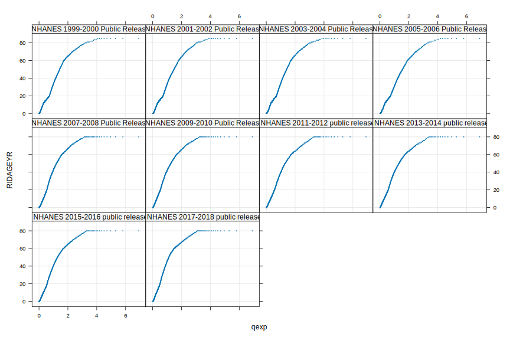

Initial Data Exploration of the `nhanesA` Package
================
Deepayan Sarkar

# Summary of available tables

Data in the `nhanesA` package are stored in a SQL Server database. The
database can be queried using the (unexported) `.nhanesQuery()` function
or its public wrapper `phonto::nhanesQuery()`.

``` r
library(nhanesA)
alltables <- nhanesA:::.nhanesQuery("select * from information_schema.tables;")
dim(alltables)
#> [1] 2965    4
head(alltables) |> kable()
```

<table>

<thead>

<tr>

<th style="text-align:left;">

TABLE\_CATALOG

</th>

<th style="text-align:left;">

TABLE\_SCHEMA

</th>

<th style="text-align:left;">

TABLE\_NAME

</th>

<th style="text-align:left;">

TABLE\_TYPE

</th>

</tr>

</thead>

<tbody>

<tr>

<td style="text-align:left;">

NhanesLandingZone

</td>

<td style="text-align:left;">

Raw

</td>

<td style="text-align:left;">

LAB03

</td>

<td style="text-align:left;">

BASE TABLE

</td>

</tr>

<tr>

<td style="text-align:left;">

NhanesLandingZone

</td>

<td style="text-align:left;">

Raw

</td>

<td style="text-align:left;">

BFRPOL\_I

</td>

<td style="text-align:left;">

BASE TABLE

</td>

</tr>

<tr>

<td style="text-align:left;">

NhanesLandingZone

</td>

<td style="text-align:left;">

Raw

</td>

<td style="text-align:left;">

TCHOL\_J

</td>

<td style="text-align:left;">

BASE TABLE

</td>

</tr>

<tr>

<td style="text-align:left;">

NhanesLandingZone

</td>

<td style="text-align:left;">

Raw

</td>

<td style="text-align:left;">

IHG\_E

</td>

<td style="text-align:left;">

BASE TABLE

</td>

</tr>

<tr>

<td style="text-align:left;">

NhanesLandingZone

</td>

<td style="text-align:left;">

Raw

</td>

<td style="text-align:left;">

SMQMEC

</td>

<td style="text-align:left;">

BASE TABLE

</td>

</tr>

<tr>

<td style="text-align:left;">

NhanesLandingZone

</td>

<td style="text-align:left;">

Raw

</td>

<td style="text-align:left;">

GHB\_E

</td>

<td style="text-align:left;">

BASE TABLE

</td>

</tr>

</tbody>

</table>

There are two versions of each table, the raw table with original codes,
and translated versions with codes translated into human-readable
values. In addition, there are some metadata and ontology tables.

``` r
subset(alltables, !(TABLE_SCHEMA %in% c("Raw", "Translated"))) |> kable()
```

<table>

<thead>

<tr>

<th style="text-align:left;">

</th>

<th style="text-align:left;">

TABLE\_CATALOG

</th>

<th style="text-align:left;">

TABLE\_SCHEMA

</th>

<th style="text-align:left;">

TABLE\_NAME

</th>

<th style="text-align:left;">

TABLE\_TYPE

</th>

</tr>

</thead>

<tbody>

<tr>

<td style="text-align:left;">

2955

</td>

<td style="text-align:left;">

NhanesLandingZone

</td>

<td style="text-align:left;">

Metadata

</td>

<td style="text-align:left;">

QuestionnaireVariables

</td>

<td style="text-align:left;">

BASE TABLE

</td>

</tr>

<tr>

<td style="text-align:left;">

2956

</td>

<td style="text-align:left;">

NhanesLandingZone

</td>

<td style="text-align:left;">

Metadata

</td>

<td style="text-align:left;">

DownloadErrors

</td>

<td style="text-align:left;">

BASE TABLE

</td>

</tr>

<tr>

<td style="text-align:left;">

2957

</td>

<td style="text-align:left;">

NhanesLandingZone

</td>

<td style="text-align:left;">

Metadata

</td>

<td style="text-align:left;">

VariableCodebook

</td>

<td style="text-align:left;">

BASE TABLE

</td>

</tr>

<tr>

<td style="text-align:left;">

2958

</td>

<td style="text-align:left;">

NhanesLandingZone

</td>

<td style="text-align:left;">

Metadata

</td>

<td style="text-align:left;">

ExcludedTables

</td>

<td style="text-align:left;">

BASE TABLE

</td>

</tr>

<tr>

<td style="text-align:left;">

2959

</td>

<td style="text-align:left;">

NhanesLandingZone

</td>

<td style="text-align:left;">

Metadata

</td>

<td style="text-align:left;">

QuestionnaireDescriptions

</td>

<td style="text-align:left;">

BASE TABLE

</td>

</tr>

<tr>

<td style="text-align:left;">

2960

</td>

<td style="text-align:left;">

NhanesLandingZone

</td>

<td style="text-align:left;">

Ontology

</td>

<td style="text-align:left;">

dbxrefs

</td>

<td style="text-align:left;">

BASE TABLE

</td>

</tr>

<tr>

<td style="text-align:left;">

2961

</td>

<td style="text-align:left;">

NhanesLandingZone

</td>

<td style="text-align:left;">

Ontology

</td>

<td style="text-align:left;">

edges

</td>

<td style="text-align:left;">

BASE TABLE

</td>

</tr>

<tr>

<td style="text-align:left;">

2962

</td>

<td style="text-align:left;">

NhanesLandingZone

</td>

<td style="text-align:left;">

Ontology

</td>

<td style="text-align:left;">

entailed\_edges

</td>

<td style="text-align:left;">

BASE TABLE

</td>

</tr>

<tr>

<td style="text-align:left;">

2963

</td>

<td style="text-align:left;">

NhanesLandingZone

</td>

<td style="text-align:left;">

Ontology

</td>

<td style="text-align:left;">

labels

</td>

<td style="text-align:left;">

BASE TABLE

</td>

</tr>

<tr>

<td style="text-align:left;">

2964

</td>

<td style="text-align:left;">

NhanesLandingZone

</td>

<td style="text-align:left;">

Ontology

</td>

<td style="text-align:left;">

synonyms

</td>

<td style="text-align:left;">

BASE TABLE

</td>

</tr>

<tr>

<td style="text-align:left;">

2965

</td>

<td style="text-align:left;">

NhanesLandingZone

</td>

<td style="text-align:left;">

Ontology

</td>

<td style="text-align:left;">

nhanes\_variables\_mappings

</td>

<td style="text-align:left;">

BASE TABLE

</td>

</tr>

</tbody>

</table>

The translated table names can be extracted as follows.

``` r
trtables <- subset(alltables, TABLE_SCHEMA == "Translated")$TABLE_NAME |> sort()
str(trtables)
#>  chr [1:1477] "AA_H" "AAS_H" "ACQ" "ACQ_B" "ACQ_C" "ACQ_D" "ACQ_E" "ACQ_F" "ACQ_G" "ACQ_H" ...
```

Many of these start with `P_`; we will skip them (they represent
releases made during the pandemic, and are inconsistent with previous
releases). The remaining tables often have suffixes (separated by
underscore) that indicate cycle, but may also have underscores in the
main table name.

``` r
std_tables <- trtables[!grepl("^P_", trtables)]
std_tables_split <- strsplit(std_tables, "_", fixed = TRUE)
std_tables[ sapply(std_tables_split, length) == 3 ]
#>  [1] "AL_IGE_D" "ALB_CR_D" "ALB_CR_E" "ALB_CR_F" "ALB_CR_G" "ALB_CR_H" "ALB_CR_I" "ALB_CR_J"
#>  [9] "DXX_2_B"  "HEPB_S_D" "HEPB_S_E" "HEPB_S_F" "HEPB_S_G" "HEPB_S_H" "HEPB_S_I" "HEPB_S_J"
#> [17] "KIQ_P_B"  "KIQ_P_C"  "KIQ_P_D"  "KIQ_P_E"  "KIQ_U_B"  "KIQ_U_C"  "KIQ_U_D"  "KIQ_U_E" 
#> [25] "KIQ_U_F"  "KIQ_U_G"  "KIQ_U_H"  "KIQ_U_I"  "KIQ_U_J"  "L06_2_B"  "L10_2_B"  "L11_2_B" 
#> [33] "L11P_2_B" "L13_2_B"  "L16_2_B"  "L19_2_B"  "L25_2_B"  "L39_2_B"  "L40_2_B"  "RXQ_RX_B"
#> [41] "RXQ_RX_C" "RXQ_RX_D" "RXQ_RX_E" "RXQ_RX_F" "RXQ_RX_G" "RXQ_RX_H" "RXQ_RX_I" "RXQ_RX_J"
#> [49] "VIT_2_B"  "VIT_B6_D" "VIT_B6_E" "VIT_B6_F"
```

We will assume that suffixes `_A`, `_B`, …, `_J` indicate cycles. The
number of times these prefixes appear are

``` r
sapply(paste0("_", LETTERS[1:10]),
       function(s) sum(endsWith(std_tables, s)))
#>  _A  _B  _C  _D  _E  _F  _G  _H  _I  _J 
#>  24 128 141 132 130 137 143 178 143 120
```

Removing these, we can get valid table names as follows.

``` r
drop_table_suffix(std_tables) |> table() |> sort(decreasing = TRUE) |> head(100)
#> 
#>    ACQ    ALQ    BMX    BPQ    BPX    CDQ    DBQ   DEMO    DIQ    DUQ    ECQ    FSQ    HIQ    HOQ 
#>     10     10     10     10     10     10     10     10     10     10     10     10     10     10 
#>    HSQ    HUQ    IMQ    MCQ    OCQ    OHQ    PAQ    PFQ    RHQ RXQ_RX    SMQ SMQFAM    WHQ    AUQ 
#>     10     10     10     10     10     10     10     10     10     10     10     10     10      9 
#>  AUXAR AUXTYM    DEQ  KIQ_U    SXQ    AUX DR1IFF DR1TOT DR2IFF DR2TOT DRXFCD OHXREF    OSQ ALB_CR 
#>      9      9      9      9      9      8      8      8      8      8      8      8      8      7 
#> BIOPRO    CBC    DPQ FASTQX FOLATE    GHB    GLU    HDL   HEPA HEPB_S  HEPBD   HEPC    HIV OHXDEN 
#>      7      7      7      7      7      7      7      7      7      7      7      7      7      7 
#>   PBCD  PERNT PHTHTE PUQMEC    RDQ    SLQ SMQRTU  TCHOL TRIGLY    UAS UCPREG    UHG    UIO  VOCWB 
#>      7      7      7      7      7      7      7      7      7      7      7      7      7      7 
#> WHQMEC BFRPOL    CBQ DS1IDS DS1TOT DS2IDS DS2TOT DSQIDS DSQTOT  DXXAG    HCQ HPVSWR    HSV    INQ 
#>      7      6      6      6      6      6      6      6      6      6      6      6      6      6 
#>   OGTT    PAH PCBPOL POOLTF PSTPOL   APOB   DEET DRXMCD DXXFEM DXXSPN FERTIN FOLFMS   HEPE    OPD 
#>      6      6      6      6      6      5      5      5      5      5      5      5      5      5 
#>   SSKL    SSQ 
#>      5      5
```

Some appear only once or twice. These are probably introduced later, and
were not necessarily continued; for example, the following two tables
relate to air quality.

``` r
std_tables[startsWith(std_tables, "AQQ")]
#> [1] "AQQ_E" "AQQ_F"
nhanesCodebook('AQQ_E') |> lapply("[[", "SAS Label:") |> str()
#> List of 14
#>  $ SEQN   : chr "Respondent sequence number"
#>  $ PAQ685 : chr "Bad air quality change activities"
#>  $ PAQ690A: chr "Wore a mask"
#>  $ PAQ690B: chr "Spent less time outdoors"
#>  $ PAQ690C: chr "Avoided roads that have heavy traffic"
#>  $ PAQ690D: chr "Did less strenuous activities"
#>  $ PAQ690E: chr "Took medication"
#>  $ PAQ690F: chr "Closed windows of your house"
#>  $ PAQ690G: chr "Drove my car less"
#>  $ PAQ690H: chr "Canceled outdoor activities"
#>  $ PAQ690I: chr "Exercised indoors instead of outdoors"
#>  $ PAQ690J: chr "Used buses trains or subways"
#>  $ PAQ690K: chr "Use or change air filter/air cleaner"
#>  $ PAQ690O: chr "Other"
```

# Using metadata tables to obtain table information

Alternatively, we can get information about available tables from the
metadata tables, although for some reason, these do not include the
`P_*` tables.

``` r
tableDesc <- nhanesA:::.nhanesQuery("select * from Metadata.QuestionnaireDescriptions")
tableDesc <- within(tableDesc, TableBase <- drop_table_suffix(TableName))
str(tableDesc)
#> 'data.frame':    1348 obs. of  10 variables:
#>  $ Description   : chr  "Acculturation" "Acculturation" "Acculturation" "Acculturation" ...
#>  $ TableName     : chr  "ACQ" "ACQ_D" "ACQ_E" "ACQ_F" ...
#>  $ BeginYear     : int  1999 2005 2007 2009 2011 2013 2015 2017 2005 2013 ...
#>  $ EndYear       : int  2000 2006 2008 2010 2012 2014 2016 2018 2006 2014 ...
#>  $ DataGroup     : chr  "Questionnaire" "Questionnaire" "Questionnaire" "Questionnaire" ...
#>  $ UseConstraints: chr  "None" "None" "None" "None" ...
#>  $ DocFile       : chr  "https://wwwn.cdc.gov/Nchs/Nhanes/1999-2000/ACQ.htm" "https://wwwn.cdc.gov/Nchs/Nhanes/2005-2006/ACQ_D.htm" "https://wwwn.cdc.gov/Nchs/Nhanes/2007-2008/ACQ_E.htm" "https://wwwn.cdc.gov/Nchs/Nhanes/2009-2010/ACQ_F.htm" ...
#>  $ DataFile      : chr  "https://wwwn.cdc.gov/Nchs/Nhanes/1999-2000/ACQ.XPT" "https://wwwn.cdc.gov/Nchs/Nhanes/2005-2006/ACQ_D.XPT" "https://wwwn.cdc.gov/Nchs/Nhanes/2007-2008/ACQ_E.XPT" "https://wwwn.cdc.gov/Nchs/Nhanes/2009-2010/ACQ_F.XPT" ...
#>  $ DatePublished : chr  "June 2002" "March 2008" "September 2009" "August 2012" ...
#>  $ TableBase     : chr  "ACQ" "ACQ" "ACQ" "ACQ" ...
```

We will work with this from now on. We can summarize this table by table
/ questionnaire descriptions as follows.

``` r
tableSummary <- 
  xtabs(~ TableBase + Description + DataGroup, tableDesc) |> 
  as.data.frame.table() |> subset(Freq > 0)
head(tableSummary, 20) |> kable() # use datatable() for html_output
```

<table>

<thead>

<tr>

<th style="text-align:left;">

</th>

<th style="text-align:left;">

TableBase

</th>

<th style="text-align:left;">

Description

</th>

<th style="text-align:left;">

DataGroup

</th>

<th style="text-align:right;">

Freq

</th>

</tr>

</thead>

<tbody>

<tr>

<td style="text-align:left;">

42234

</td>

<td style="text-align:left;">

DEMO

</td>

<td style="text-align:left;">

Demographic Variables & Sample Weights

</td>

<td style="text-align:left;">

Demographics

</td>

<td style="text-align:right;">

7

</td>

</tr>

<tr>

<td style="text-align:left;">

42660

</td>

<td style="text-align:left;">

DEMO

</td>

<td style="text-align:left;">

Demographic Variables and Sample Weights

</td>

<td style="text-align:left;">

Demographics

</td>

<td style="text-align:right;">

3

</td>

</tr>

<tr>

<td style="text-align:left;">

225000

</td>

<td style="text-align:left;">

DRXIFF

</td>

<td style="text-align:left;">

Dietary Interview - Individual Foods

</td>

<td style="text-align:left;">

Dietary

</td>

<td style="text-align:right;">

2

</td>

</tr>

<tr>

<td style="text-align:left;">

225421

</td>

<td style="text-align:left;">

DR1IFF

</td>

<td style="text-align:left;">

Dietary Interview - Individual Foods, First Day

</td>

<td style="text-align:left;">

Dietary

</td>

<td style="text-align:right;">

8

</td>

</tr>

<tr>

<td style="text-align:left;">

225849

</td>

<td style="text-align:left;">

DR2IFF

</td>

<td style="text-align:left;">

Dietary Interview - Individual Foods, Second Day

</td>

<td style="text-align:left;">

Dietary

</td>

<td style="text-align:right;">

8

</td>

</tr>

<tr>

<td style="text-align:left;">

226280

</td>

<td style="text-align:left;">

DRXTOT

</td>

<td style="text-align:left;">

Dietary Interview - Total Nutrient Intakes

</td>

<td style="text-align:left;">

Dietary

</td>

<td style="text-align:right;">

2

</td>

</tr>

<tr>

<td style="text-align:left;">

226700

</td>

<td style="text-align:left;">

DR1TOT

</td>

<td style="text-align:left;">

Dietary Interview - Total Nutrient Intakes, First Day

</td>

<td style="text-align:left;">

Dietary

</td>

<td style="text-align:right;">

8

</td>

</tr>

<tr>

<td style="text-align:left;">

227128

</td>

<td style="text-align:left;">

DR2TOT

</td>

<td style="text-align:left;">

Dietary Interview - Total Nutrient Intakes, Second Day

</td>

<td style="text-align:left;">

Dietary

</td>

<td style="text-align:right;">

8

</td>

</tr>

<tr>

<td style="text-align:left;">

227555

</td>

<td style="text-align:left;">

DRXFCD

</td>

<td style="text-align:left;">

Dietary Interview Technical Support File - Food Codes

</td>

<td style="text-align:left;">

Dietary

</td>

<td style="text-align:right;">

6

</td>

</tr>

<tr>

<td style="text-align:left;">

227983

</td>

<td style="text-align:left;">

DRXMCD

</td>

<td style="text-align:left;">

Dietary Interview Technical Support File - Modification Codes

</td>

<td style="text-align:left;">

Dietary

</td>

<td style="text-align:right;">

5

</td>

</tr>

<tr>

<td style="text-align:left;">

228421

</td>

<td style="text-align:left;">

DTQ

</td>

<td style="text-align:left;">

Dietary Screener Questionnaire

</td>

<td style="text-align:left;">

Dietary

</td>

<td style="text-align:right;">

1

</td>

</tr>

<tr>

<td style="text-align:left;">

228837

</td>

<td style="text-align:left;">

DS1IDS

</td>

<td style="text-align:left;">

Dietary Supplement Use 24-Hour - Individual Dietary Supplements, First
Day

</td>

<td style="text-align:left;">

Dietary

</td>

<td style="text-align:right;">

6

</td>

</tr>

<tr>

<td style="text-align:left;">

229265

</td>

<td style="text-align:left;">

DS2IDS

</td>

<td style="text-align:left;">

Dietary Supplement Use 24-Hour - Individual Dietary Supplements, Second
Day

</td>

<td style="text-align:left;">

Dietary

</td>

<td style="text-align:right;">

6

</td>

</tr>

<tr>

<td style="text-align:left;">

229690

</td>

<td style="text-align:left;">

DS1TOT

</td>

<td style="text-align:left;">

Dietary Supplement Use 24-Hour - Total Dietary Supplements, First Day

</td>

<td style="text-align:left;">

Dietary

</td>

<td style="text-align:right;">

6

</td>

</tr>

<tr>

<td style="text-align:left;">

230118

</td>

<td style="text-align:left;">

DS2TOT

</td>

<td style="text-align:left;">

Dietary Supplement Use 24-Hour - Total Dietary Supplements, Second Day

</td>

<td style="text-align:left;">

Dietary

</td>

<td style="text-align:right;">

6

</td>

</tr>

<tr>

<td style="text-align:left;">

230549

</td>

<td style="text-align:left;">

DSQIDS

</td>

<td style="text-align:left;">

Dietary Supplement Use 30 Day - Individual Dietary Supplements

</td>

<td style="text-align:left;">

Dietary

</td>

<td style="text-align:right;">

3

</td>

</tr>

<tr>

<td style="text-align:left;">

230971

</td>

<td style="text-align:left;">

DSQ1

</td>

<td style="text-align:left;">

Dietary Supplement Use 30-Day - File 1, Supplement Counts

</td>

<td style="text-align:left;">

Dietary

</td>

<td style="text-align:right;">

3

</td>

</tr>

<tr>

<td style="text-align:left;">

230973

</td>

<td style="text-align:left;">

DSQFILE1

</td>

<td style="text-align:left;">

Dietary Supplement Use 30-Day - File 1, Supplement Counts

</td>

<td style="text-align:left;">

Dietary

</td>

<td style="text-align:right;">

1

</td>

</tr>

<tr>

<td style="text-align:left;">

231398

</td>

<td style="text-align:left;">

DSQ2

</td>

<td style="text-align:left;">

Dietary Supplement Use 30-Day - File 2, Participant’s Use of Supplements

</td>

<td style="text-align:left;">

Dietary

</td>

<td style="text-align:right;">

3

</td>

</tr>

<tr>

<td style="text-align:left;">

231400

</td>

<td style="text-align:left;">

DSQFILE2

</td>

<td style="text-align:left;">

Dietary Supplement Use 30-Day - File 2, Participant’s Use of Supplements

</td>

<td style="text-align:left;">

Dietary

</td>

<td style="text-align:right;">

1

</td>

</tr>

</tbody>

</table>

# Extracting table data

Before trying to analyse any data, we may be interested in knowing
whether the codebook has changed for a particular table across different
cycles. Let’s try this with the demographic tables.

``` r
demotables <- get_table_names('DEMO', db = tableDesc)
cb.demo <- lapply(demotables, function(x) names(nhanesCodebook(x)))
str(cb.demo)
#> List of 10
#>  $ : chr [1:145] "SEQN" "SDDSRVYR" "RIDSTATR" "RIDEXMON" ...
#>  $ : chr [1:37] "SEQN" "SDDSRVYR" "RIDSTATR" "RIDEXMON" ...
#>  $ : chr [1:44] "SEQN" "SDDSRVYR" "RIDSTATR" "RIDEXMON" ...
#>  $ : chr [1:43] "SEQN" "SDDSRVYR" "RIDSTATR" "RIDEXMON" ...
#>  $ : chr [1:43] "SEQN" "SDDSRVYR" "RIDSTATR" "RIDEXMON" ...
#>  $ : chr [1:43] "SEQN" "SDDSRVYR" "RIDSTATR" "RIDEXMON" ...
#>  $ : chr [1:48] "SEQN" "SDDSRVYR" "RIDSTATR" "RIAGENDR" ...
#>  $ : chr [1:47] "SEQN" "SDDSRVYR" "RIDSTATR" "RIAGENDR" ...
#>  $ : chr [1:47] "SEQN" "SDDSRVYR" "RIDSTATR" "RIAGENDR" ...
#>  $ : chr [1:46] "SEQN" "SDDSRVYR" "RIDSTATR" "RIAGENDR" ...
```

So the number of recorded variables keep changing. To combine across
years, we will get all common variables, assuming that their
interpretations have not changed over cycles.

``` r
demovars <- get_common_vars(demotables)
str(demovars)
#>  chr [1:21] "SEQN" "SDDSRVYR" "RIDSTATR" "RIDEXMON" "RIAGENDR" "RIDAGEYR" "RIDAGEMN" "RIDRETH1" ...
```

We can then merge all versions of a table by restricting to these common
variables.

``` r
demo.all <- merge_tables(demotables)
```

Some elementary summaries of the demographic variables:

``` r
qqmath(~ RIDAGEYR | SDDSRVYR, demo.all, plot.points = FALSE, distribution = qexp,
       f.value = ppoints(500), pch = ".", cex = 2, as.table = TRUE, grid = TRUE)
```



``` r
xtabs(~ SDDSRVYR + RIAGENDR + RIDRETH1, demo.all) |> 
  dotplot(auto.key = list(columns = 2), type = "o", 
          par.settings = simpleTheme(pch = 16))
```


# Combining tables for analysis

Suppose we want to combine demographic data with data from one or more
other tables to perform some analysis. Let’s start by looking at which
tables have been populated in most (at least 8) cycles. The `DEMO` table
will not appear in this list because it has two slightly different
descriptions (with frequencies 7 and 3).

``` r
subset(tableSummary, Freq > 7) |> kable()
```

<table>

<thead>

<tr>

<th style="text-align:left;">

</th>

<th style="text-align:left;">

TableBase

</th>

<th style="text-align:left;">

Description

</th>

<th style="text-align:left;">

DataGroup

</th>

<th style="text-align:right;">

Freq

</th>

</tr>

</thead>

<tbody>

<tr>

<td style="text-align:left;">

225421

</td>

<td style="text-align:left;">

DR1IFF

</td>

<td style="text-align:left;">

Dietary Interview - Individual Foods, First Day

</td>

<td style="text-align:left;">

Dietary

</td>

<td style="text-align:right;">

8

</td>

</tr>

<tr>

<td style="text-align:left;">

225849

</td>

<td style="text-align:left;">

DR2IFF

</td>

<td style="text-align:left;">

Dietary Interview - Individual Foods, Second Day

</td>

<td style="text-align:left;">

Dietary

</td>

<td style="text-align:right;">

8

</td>

</tr>

<tr>

<td style="text-align:left;">

226700

</td>

<td style="text-align:left;">

DR1TOT

</td>

<td style="text-align:left;">

Dietary Interview - Total Nutrient Intakes, First Day

</td>

<td style="text-align:left;">

Dietary

</td>

<td style="text-align:right;">

8

</td>

</tr>

<tr>

<td style="text-align:left;">

227128

</td>

<td style="text-align:left;">

DR2TOT

</td>

<td style="text-align:left;">

Dietary Interview - Total Nutrient Intakes, Second Day

</td>

<td style="text-align:left;">

Dietary

</td>

<td style="text-align:right;">

8

</td>

</tr>

<tr>

<td style="text-align:left;">

373621

</td>

<td style="text-align:left;">

AUX

</td>

<td style="text-align:left;">

Audiometry

</td>

<td style="text-align:left;">

Examination

</td>

<td style="text-align:right;">

8

</td>

</tr>

<tr>

<td style="text-align:left;">

374049

</td>

<td style="text-align:left;">

AUXAR

</td>

<td style="text-align:left;">

Audiometry - Acoustic Reflex

</td>

<td style="text-align:left;">

Examination

</td>

<td style="text-align:right;">

9

</td>

</tr>

<tr>

<td style="text-align:left;">

374476

</td>

<td style="text-align:left;">

AUXTYM

</td>

<td style="text-align:left;">

Audiometry - Tympanometry

</td>

<td style="text-align:left;">

Examination

</td>

<td style="text-align:right;">

9

</td>

</tr>

<tr>

<td style="text-align:left;">

377895

</td>

<td style="text-align:left;">

BPX

</td>

<td style="text-align:left;">

Blood Pressure

</td>

<td style="text-align:left;">

Examination

</td>

<td style="text-align:right;">

10

</td>

</tr>

<tr>

<td style="text-align:left;">

379171

</td>

<td style="text-align:left;">

BMX

</td>

<td style="text-align:left;">

Body Measures

</td>

<td style="text-align:left;">

Examination

</td>

<td style="text-align:right;">

10

</td>

</tr>

<tr>

<td style="text-align:left;">

483784

</td>

<td style="text-align:left;">

OHXREF

</td>

<td style="text-align:left;">

Oral Health - Recommendation of Care

</td>

<td style="text-align:left;">

Examination

</td>

<td style="text-align:right;">

8

</td>

</tr>

<tr>

<td style="text-align:left;">

722499

</td>

<td style="text-align:left;">

ACQ

</td>

<td style="text-align:left;">

Acculturation

</td>

<td style="text-align:left;">

Questionnaire

</td>

<td style="text-align:right;">

10

</td>

</tr>

<tr>

<td style="text-align:left;">

725062

</td>

<td style="text-align:left;">

ALQ

</td>

<td style="text-align:left;">

Alcohol Use

</td>

<td style="text-align:left;">

Questionnaire

</td>

<td style="text-align:right;">

10

</td>

</tr>

<tr>

<td style="text-align:left;">

734868

</td>

<td style="text-align:left;">

AUQ

</td>

<td style="text-align:left;">

Audiometry

</td>

<td style="text-align:left;">

Questionnaire

</td>

<td style="text-align:right;">

9

</td>

</tr>

<tr>

<td style="text-align:left;">

739994

</td>

<td style="text-align:left;">

BPQ

</td>

<td style="text-align:left;">

Blood Pressure & Cholesterol

</td>

<td style="text-align:left;">

Questionnaire

</td>

<td style="text-align:right;">

10

</td>

</tr>

<tr>

<td style="text-align:left;">

747671

</td>

<td style="text-align:left;">

CDQ

</td>

<td style="text-align:left;">

Cardiovascular Health

</td>

<td style="text-align:left;">

Questionnaire

</td>

<td style="text-align:right;">

10

</td>

</tr>

<tr>

<td style="text-align:left;">

761414

</td>

<td style="text-align:left;">

HSQ

</td>

<td style="text-align:left;">

Current Health Status

</td>

<td style="text-align:left;">

Questionnaire

</td>

<td style="text-align:right;">

10

</td>

</tr>

<tr>

<td style="text-align:left;">

765583

</td>

<td style="text-align:left;">

DEQ

</td>

<td style="text-align:left;">

Dermatology

</td>

<td style="text-align:left;">

Questionnaire

</td>

<td style="text-align:right;">

9

</td>

</tr>

<tr>

<td style="text-align:left;">

766011

</td>

<td style="text-align:left;">

DIQ

</td>

<td style="text-align:left;">

Diabetes

</td>

<td style="text-align:left;">

Questionnaire

</td>

<td style="text-align:right;">

10

</td>

</tr>

<tr>

<td style="text-align:left;">

766432

</td>

<td style="text-align:left;">

DBQ

</td>

<td style="text-align:left;">

Diet Behavior & Nutrition

</td>

<td style="text-align:left;">

Questionnaire

</td>

<td style="text-align:right;">

10

</td>

</tr>

<tr>

<td style="text-align:left;">

775406

</td>

<td style="text-align:left;">

DUQ

</td>

<td style="text-align:left;">

Drug Use

</td>

<td style="text-align:left;">

Questionnaire

</td>

<td style="text-align:right;">

10

</td>

</tr>

<tr>

<td style="text-align:left;">

786078

</td>

<td style="text-align:left;">

ECQ

</td>

<td style="text-align:left;">

Early Childhood

</td>

<td style="text-align:left;">

Questionnaire

</td>

<td style="text-align:right;">

10

</td>

</tr>

<tr>

<td style="text-align:left;">

798879

</td>

<td style="text-align:left;">

FSQ

</td>

<td style="text-align:left;">

Food Security

</td>

<td style="text-align:left;">

Questionnaire

</td>

<td style="text-align:right;">

10

</td>

</tr>

<tr>

<td style="text-align:left;">

801875

</td>

<td style="text-align:left;">

HIQ

</td>

<td style="text-align:left;">

Health Insurance

</td>

<td style="text-align:left;">

Questionnaire

</td>

<td style="text-align:right;">

10

</td>

</tr>

<tr>

<td style="text-align:left;">

813388

</td>

<td style="text-align:left;">

HUQ

</td>

<td style="text-align:left;">

Hospital Utilization & Access to Care

</td>

<td style="text-align:left;">

Questionnaire

</td>

<td style="text-align:right;">

10

</td>

</tr>

<tr>

<td style="text-align:left;">

813805

</td>

<td style="text-align:left;">

HOQ

</td>

<td style="text-align:left;">

Housing Characteristics

</td>

<td style="text-align:left;">

Questionnaire

</td>

<td style="text-align:right;">

10

</td>

</tr>

<tr>

<td style="text-align:left;">

820207

</td>

<td style="text-align:left;">

IMQ

</td>

<td style="text-align:left;">

Immunization

</td>

<td style="text-align:left;">

Questionnaire

</td>

<td style="text-align:right;">

10

</td>

</tr>

<tr>

<td style="text-align:left;">

823194

</td>

<td style="text-align:left;">

KIQ\_U

</td>

<td style="text-align:left;">

Kidney Conditions - Urology

</td>

<td style="text-align:left;">

Questionnaire

</td>

<td style="text-align:right;">

9

</td>

</tr>

<tr>

<td style="text-align:left;">

828827

</td>

<td style="text-align:left;">

MCQ

</td>

<td style="text-align:left;">

Medical Conditions

</td>

<td style="text-align:left;">

Questionnaire

</td>

<td style="text-align:right;">

10

</td>

</tr>

<tr>

<td style="text-align:left;">

840761

</td>

<td style="text-align:left;">

OCQ

</td>

<td style="text-align:left;">

Occupation

</td>

<td style="text-align:left;">

Questionnaire

</td>

<td style="text-align:right;">

10

</td>

</tr>

<tr>

<td style="text-align:left;">

842467

</td>

<td style="text-align:left;">

OHQ

</td>

<td style="text-align:left;">

Oral Health

</td>

<td style="text-align:left;">

Questionnaire

</td>

<td style="text-align:right;">

10

</td>

</tr>

<tr>

<td style="text-align:left;">

846741

</td>

<td style="text-align:left;">

OSQ

</td>

<td style="text-align:left;">

Osteoporosis

</td>

<td style="text-align:left;">

Questionnaire

</td>

<td style="text-align:right;">

8

</td>

</tr>

<tr>

<td style="text-align:left;">

859523

</td>

<td style="text-align:left;">

PAQ

</td>

<td style="text-align:left;">

Physical Activity

</td>

<td style="text-align:left;">

Questionnaire

</td>

<td style="text-align:right;">

10

</td>

</tr>

<tr>

<td style="text-align:left;">

862091

</td>

<td style="text-align:left;">

PFQ

</td>

<td style="text-align:left;">

Physical Functioning

</td>

<td style="text-align:left;">

Questionnaire

</td>

<td style="text-align:right;">

10

</td>

</tr>

<tr>

<td style="text-align:left;">

868071

</td>

<td style="text-align:left;">

RXQ\_RX

</td>

<td style="text-align:left;">

Prescription Medications

</td>

<td style="text-align:left;">

Questionnaire

</td>

<td style="text-align:right;">

10

</td>

</tr>

<tr>

<td style="text-align:left;">

872329

</td>

<td style="text-align:left;">

RHQ

</td>

<td style="text-align:left;">

Reproductive Health

</td>

<td style="text-align:left;">

Questionnaire

</td>

<td style="text-align:right;">

10

</td>

</tr>

<tr>

<td style="text-align:left;">

874949

</td>

<td style="text-align:left;">

SXQ

</td>

<td style="text-align:left;">

Sexual Behavior

</td>

<td style="text-align:left;">

Questionnaire

</td>

<td style="text-align:right;">

9

</td>

</tr>

<tr>

<td style="text-align:left;">

877449

</td>

<td style="text-align:left;">

SMQFAM

</td>

<td style="text-align:left;">

Smoking - Household Smokers

</td>

<td style="text-align:left;">

Questionnaire

</td>

<td style="text-align:right;">

10

</td>

</tr>

<tr>

<td style="text-align:left;">

902692

</td>

<td style="text-align:left;">

WHQ

</td>

<td style="text-align:left;">

Weight History

</td>

<td style="text-align:left;">

Questionnaire

</td>

<td style="text-align:right;">

10

</td>

</tr>

</tbody>

</table>

Let’s say we now want to combine the tables DEMO, WHQ (Weight history),
BPX (Blood pressure), and BMX (Body measurements), which have the
following variables.

``` r
sapply(nhanesCodebook('WHQ'), "[[", "SAS Label:")
#>                                       SEQN                                     WHD010 
#>               "Respondent sequence number"    "Current self-reported height (inches)" 
#>                                     WHD020                                     WHQ030 
#>    "Current self-reported weight (pounds)"          "How do you consider your weight" 
#>                                     WHD040                                     WHD050 
#>          "Like to weigh more less or same"   "Self-reported weight-1 yr ago (pounds)" 
#>                                     WHD060                                     WHQ070 
#>                "Weight change intentional"        "Tried to lose weight in past year" 
#>                                    WHD080A                                    WHD080B 
#>             "Ate less food to lose weight"          "Lowered calories to lose weight" 
#>                                    WHQ080C                                    WHD080D 
#>              "Ate less fat to lose weight"                 "Exercised to lose weight" 
#>                                    WHQ080E                                    WHD080F 
#>             "Skipped meals to lose weight"         "Ate diet products to lose weight" 
#>                                    WHQ080G                                    WHQ080H 
#>  "Used liquid diet formula to lose weight"            "Joined program to lose weight" 
#>                                    WHQ080I                                    WHQ080J 
#>        "Took RX diet pills to lose weight"        "Took non-RX suppl. to lose weight" 
#>                                    WHQ080K                                    WHD080L 
#>            "Took laxatives to lose weight"             "Other methods to lose weight" 
#>                                    WHD080M                                    WHD080N 
#>      "Drank a lot of water to lose weight"                  "Followed a special diet" 
#>                                     WHQ090                                    WHQ100A 
#>    "Tried not to gain weight in past year"              "Ate less to not gain weight" 
#>                                    WHQ100B                                    WHD100C 
#>      "Lowered calories to not gain weight"          "Ate less fat to not gain weight" 
#>                                    WHD100D                                    WHQ100E 
#>                                "Exercised"         "Skipped meals to not gain weight" 
#>                                    WHD100F                                    WHQ100G 
#>        "Ate diet foods to not gain weight"     "Used liquid diet formula to not gain" 
#>                                    WHQ100H                                    WHQ100I 
#>        "Joined program to not gain weight"           "Took RX diet pills to not gain" 
#>                                    WHQ100J                                    WHQ100K 
#>    "Took non-RX suppl. to not gain weight"        "Took laxatives to not gain weight" 
#>                                    WHD100L                                    WHD100M 
#>             "Other methods to lose weight"  "Drank a lot of water to not gain weight" 
#>                                    WHD100N                                     WHD110 
#>   "Followed a special diet to lose weight" "Self-reported weight-10 yrs ago (pounds)" 
#>                                     WHD120                                     WHD130 
#>   "Self-reported weight - age 25 (pounds)"   "Self-reported height - age 25 (inches)" 
#>                                     WHD140                                     WHD150 
#>   "Self-reported greatest weight (pounds)"                 "Age when heaviest weight" 
#>                                     WHD160                                     WHD170 
#> "Least self-reported weight since 18(lbs)"                 "Age when lightest weight"
sapply(nhanesCodebook('BMX'), "[[", "SAS Label:")
#>                                    SEQN                                BMAEXLEN 
#>            "Respondent sequence number"            "Length of a MEC exam (sec)" 
#>                                BMAEXSTS                                BMAEXCMT 
#>                  "Status of a MEC exam"              "Comment code for an exam" 
#>                                   BMXWT                                   BMIWT 
#>                           "Weight (kg)"                        "Weight Comment" 
#>                                BMXRECUM                                BMIRECUM 
#>                 "Recumbent Length (cm)"              "Recumbent Length Comment" 
#>                                 BMXHEAD                                 BMIHEAD 
#>               "Head Circumference (cm)"            "Head Circumference Comment" 
#>                                   BMXHT                                   BMIHT 
#>                  "Standing Height (cm)"               "Standing Height Comment" 
#>                                  BMXBMI                                  BMXLEG 
#>             "Body Mass Index (kg/m**2)"                 "Upper Leg Length (cm)" 
#>                                  BMILEG                                 BMXCALF 
#>              "Upper Leg Length Comment"       "Maximal Calf Circumference (cm)" 
#>                                 BMICALF                                 BMXARML 
#>                  "Maximal Calf Comment"                 "Upper Arm Length (cm)" 
#>                                 BMIARML                                 BMXARMC 
#>              "Upper Arm Length Comment"                "Arm Circumference (cm)" 
#>                                 BMIARMC                                BMXWAIST 
#>             "Arm Circumference Comment"              "Waist Circumference (cm)" 
#>                                BMIWAIST                                BMXTHICR 
#>           "Waist Circumference Comment"              "Thigh Circumference (cm)" 
#>                                BMITHICR                                  BMXTRI 
#>           "Thigh Circumference Comment"                 "Triceps Skinfold (mm)" 
#>                                  BMITRI                                  BMXSUB 
#>              "Triceps Skinfold Comment"             "Subscapular Skinfold (mm)" 
#>                                  BMISUB                                  BMAAMP 
#>          "Subscapular Skinfold Comment"                          "Amputations?" 
#>                                BMAUREXT                                BMAUPREL 
#>   "Amputations: Upper Right Extremity?" "Amputations: UR Above or Below Elbow?" 
#>                                BMAULEXT                                BMAUPLEL 
#>    "Amputations: Upper Left Extremity?" "Amputations: UL Above or Below Elbow?" 
#>                                BMALOREX                                BMALORKN 
#>   "Amputations: Lower Right Extremity?"  "Amputations: LR Above or Below Knee?" 
#>                                BMALLEXT                                BMALLKNE 
#>    "Amputations: Lower Left Extremity?"  "Amputations: LL Above or Below Knee?"
sapply(nhanesCodebook('BPX'), "[[", "SAS Label:")
#>                                     SEQN                                 PEASCST1 
#>             "Respondent sequence number"                  "Blood Pressure Status" 
#>                                 PEASCTM1                                 PEASCCT1 
#>         "Blood Pressure Time in Seconds"                 "Blood Pressure Comment" 
#>                                   BPXCHR                                  BPQ150A 
#>              "60 sec HR (30 sec HR * 2)"       "Had food in the past 30 minutes?" 
#>                                  BPQ150B                                  BPQ150C 
#>    "Had alcohol in the past 30 minutes?"     "Had coffee in the past 30 minutes?" 
#>                                  BPQ150D                                   BPAARM 
#> "Had cigarettes in the past 30 minutes?"                          "Arm selected:" 
#>                                   BPACSZ                                   BPXPLS 
#>                        "Coded cuff size"     "60 sec. pulse (30 sec. pulse * 2):" 
#>                                    BPXDB                                  BPXPULS 
#>       "# of dropped beats in 30 seconds"            "Pulse regular or irregular?" 
#>                                   BPXPTY                                   BPXML1 
#>                            "Pulse type:"  "MIL: maximum inflation levels (mm Hg)" 
#>                                   BPXSY1                                   BPXDI1 
#>   "Systolic: Blood pres (1st rdg) mm Hg"  "Diastolic: Blood pres (1st rdg) mm Hg" 
#>                                   BPAEN1                                   BPXSY2 
#>         "Enhancement used first reading"   "Systolic: Blood pres (2nd rdg) mm Hg" 
#>                                   BPXDI2                                   BPAEN2 
#>  "Diastolic: Blood pres (2nd rdg) mm Hg"        "Enhancement used second reading" 
#>                                   BPXSY3                                   BPXDI3 
#>   "Systolic: Blood pres (3rd rdg) mm Hg"  "Diastolic: Blood pres (3rd rdg) mm Hg" 
#>                                   BPAEN3                                   BPXSY4 
#>         "Enhancement used third reading"   "Systolic: Blood pres (4th rdg) mm Hg" 
#>                                   BPXDI4                                   BPAEN4 
#>  "Diastolic: Blood pres (4th rdg) mm Hg"        "Enhancement used fourth reading" 
#>                                   BPXSAR                                   BPXDAR 
#>       "SBP average reported to examinee"       "DBP average reported to examinee"
```

We can combine the tables individually as above.

``` r
wtables <- c("DEMO", "WHQ", "BMX", "BPX")
tablist <- lapply(wtables, function(x) merge_tables(get_table_names(x, tableDesc)))
names(tablist) <- wtables
sapply(tablist, nrow)
#>   DEMO    WHQ    BMX    BPX 
#> 101316  63592  96766  96766
```

We can now easily merge them by first subsetting to common `SEQN` values
(in the same order).

``` r
common_id <- Reduce(intersect, lapply(tablist, "[[", "SEQN"))
tablist_common <- lapply(tablist, function(d) d[match(common_id, d$SEQN), ])
dcombined <- Reduce(merge, tablist)
```

We are ready for some anaylsis. But variable names are still
incomprehensible without referring to codebook. We can get variable
descriptions from one of the metadata tables.

``` r
variableDesc <- nhanesA:::.nhanesQuery("select * from Metadata.QuestionnaireVariables")
```

This table does include the `P_*` tables, which we will exclude; because
among other reasons, they have not been processed correctly, e.g.,

``` r
subset(variableDesc, TableName |> startsWith("P_")) |> head()
#>       Variable TableName                Description Target                   SasLabel
#> 36989     SEQN     P_ACQ Respondent sequence number   <NA> Respondent sequence number
#> 36990  ACD011A     P_ACQ                       <NA>   <NA>                       <NA>
#> 36991  ACD011B     P_ACQ                       <NA>   <NA>                       <NA>
#> 36992  ACD011C     P_ACQ                       <NA>   <NA>                       <NA>
#> 36993   ACD040     P_ACQ                       <NA>   <NA>                       <NA>
#> 36994   ACD110     P_ACQ                       <NA>   <NA>                       <NA>
#>       UseConstraints ProcessedText Tags VariableID OntologyMapped
#> 36989           <NA>          <NA> <NA>       <NA>           <NA>
#> 36990           <NA>          <NA> <NA>       <NA>           <NA>
#> 36991           <NA>          <NA> <NA>       <NA>           <NA>
#> 36992           <NA>          <NA> <NA>       <NA>           <NA>
#> 36993           <NA>          <NA> <NA>       <NA>           <NA>
#> 36994           <NA>          <NA> <NA>       <NA>           <NA>
```

even though <https://wwwn.cdc.gov/Nchs/Nhanes/2017-2018/P_ACQ.htm> has
the relevant information. So,

``` r
variableDesc <- subset(variableDesc, !startsWith(TableName, "P_"))
uvarDesc <- subset(variableDesc, Variable %in% names(dcombined), select = c(Variable, SasLabel)) |> unique()
```

We can do a crude search over the SAS labels using `agrepl()`.

``` r
subset(uvarDesc, agrepl("weight", SasLabel, ignore.case = TRUE, fixed = TRUE)) |> kable()
```

<table>

<thead>

<tr>

<th style="text-align:left;">

</th>

<th style="text-align:left;">

Variable

</th>

<th style="text-align:left;">

SasLabel

</th>

</tr>

</thead>

<tbody>

<tr>

<td style="text-align:left;">

8556

</td>

<td style="text-align:left;">

BMXWT

</td>

<td style="text-align:left;">

Weight (kg)

</td>

</tr>

<tr>

<td style="text-align:left;">

8557

</td>

<td style="text-align:left;">

BMIWT

</td>

<td style="text-align:left;">

Weight Comment

</td>

</tr>

<tr>

<td style="text-align:left;">

8562

</td>

<td style="text-align:left;">

BMXHT

</td>

<td style="text-align:left;">

Standing Height (cm)

</td>

</tr>

<tr>

<td style="text-align:left;">

8563

</td>

<td style="text-align:left;">

BMIHT

</td>

<td style="text-align:left;">

Standing Height Comment

</td>

</tr>

<tr>

<td style="text-align:left;">

12443

</td>

<td style="text-align:left;">

WTINT2YR

</td>

<td style="text-align:left;">

Full Sample 2 Year Interview Weight

</td>

</tr>

<tr>

<td style="text-align:left;">

12445

</td>

<td style="text-align:left;">

WTMEC2YR

</td>

<td style="text-align:left;">

Full Sample 2 Year MEC Exam Weight

</td>

</tr>

<tr>

<td style="text-align:left;">

12797

</td>

<td style="text-align:left;">

WTINT2YR

</td>

<td style="text-align:left;">

Full sample 2 year interview weight

</td>

</tr>

<tr>

<td style="text-align:left;">

12798

</td>

<td style="text-align:left;">

WTMEC2YR

</td>

<td style="text-align:left;">

Full sample 2 year MEC exam weight

</td>

</tr>

<tr>

<td style="text-align:left;">

50012

</td>

<td style="text-align:left;">

WHD010

</td>

<td style="text-align:left;">

Current self-reported height (inches)

</td>

</tr>

<tr>

<td style="text-align:left;">

50013

</td>

<td style="text-align:left;">

WHD020

</td>

<td style="text-align:left;">

Current self-reported weight (pounds)

</td>

</tr>

<tr>

<td style="text-align:left;">

50014

</td>

<td style="text-align:left;">

WHQ030

</td>

<td style="text-align:left;">

How do you consider your weight

</td>

</tr>

<tr>

<td style="text-align:left;">

50016

</td>

<td style="text-align:left;">

WHD050

</td>

<td style="text-align:left;">

Self-reported weight-1 yr ago (pounds)

</td>

</tr>

<tr>

<td style="text-align:left;">

50018

</td>

<td style="text-align:left;">

WHQ070

</td>

<td style="text-align:left;">

Tried to lose weight in past year

</td>

</tr>

<tr>

<td style="text-align:left;">

50019

</td>

<td style="text-align:left;">

WHD080A

</td>

<td style="text-align:left;">

Ate less food to lose weight

</td>

</tr>

<tr>

<td style="text-align:left;">

50020

</td>

<td style="text-align:left;">

WHD080B

</td>

<td style="text-align:left;">

Lowered calories to lose weight

</td>

</tr>

<tr>

<td style="text-align:left;">

50022

</td>

<td style="text-align:left;">

WHD080D

</td>

<td style="text-align:left;">

Exercised to lose weight

</td>

</tr>

<tr>

<td style="text-align:left;">

50024

</td>

<td style="text-align:left;">

WHD080F

</td>

<td style="text-align:left;">

Ate diet products to lose weight

</td>

</tr>

<tr>

<td style="text-align:left;">

50030

</td>

<td style="text-align:left;">

WHD080L

</td>

<td style="text-align:left;">

Other methods to lose weight

</td>

</tr>

<tr>

<td style="text-align:left;">

50031

</td>

<td style="text-align:left;">

WHD080M

</td>

<td style="text-align:left;">

Drank a lot of water to lose weight

</td>

</tr>

<tr>

<td style="text-align:left;">

50048

</td>

<td style="text-align:left;">

WHD110

</td>

<td style="text-align:left;">

Self-reported weight-10 yrs ago (pounds)

</td>

</tr>

<tr>

<td style="text-align:left;">

50049

</td>

<td style="text-align:left;">

WHD120

</td>

<td style="text-align:left;">

Self-reported weight - age 25 (pounds)

</td>

</tr>

<tr>

<td style="text-align:left;">

50050

</td>

<td style="text-align:left;">

WHD130

</td>

<td style="text-align:left;">

Self-reported height - age 25 (inches)

</td>

</tr>

<tr>

<td style="text-align:left;">

50051

</td>

<td style="text-align:left;">

WHD140

</td>

<td style="text-align:left;">

Self-reported greatest weight (pounds)

</td>

</tr>

<tr>

<td style="text-align:left;">

50095

</td>

<td style="text-align:left;">

WHD140

</td>

<td style="text-align:left;">

Self-reported greatest weight(pounds)

</td>

</tr>

<tr>

<td style="text-align:left;">

50144

</td>

<td style="text-align:left;">

WHD050

</td>

<td style="text-align:left;">

Self-reported weight - 1 yr ago (pounds)

</td>

</tr>

<tr>

<td style="text-align:left;">

50147

</td>

<td style="text-align:left;">

WHD080A

</td>

<td style="text-align:left;">

Ate less to lose weight

</td>

</tr>

<tr>

<td style="text-align:left;">

50195

</td>

<td style="text-align:left;">

WHD120

</td>

<td style="text-align:left;">

Self-reported weight-age 25 (pounds)

</td>

</tr>

</tbody>

</table>

Now that we have a merged dataset, we can use it for standard data
analysis. Let’s start by looking at how self-reported weight compares
with actual measured weight.

``` r
xyplot(WHD020 ~ BMXWT, dcombined)
```


The reason for the weird values on the y-axis is that special codes for
`WHD020` have not been translated.

``` r
nhanesCodebook("BMX")[["BMXWT"]][["BMXWT"]] # no issues - only missing
#>   Code.or.Value Value.Description Count Cumulative Skip.to.Item
#> 1  3.1 to 193.3   Range of Values  9197       9197         <NA>
#> 2             .           Missing    85       9282         <NA>
subset(variableDesc, Variable == "WHD020", select = c(1, 2, 5)) |> kable()
```

<table>

<thead>

<tr>

<th style="text-align:left;">

</th>

<th style="text-align:left;">

Variable

</th>

<th style="text-align:left;">

TableName

</th>

<th style="text-align:left;">

SasLabel

</th>

</tr>

</thead>

<tbody>

<tr>

<td style="text-align:left;">

50013

</td>

<td style="text-align:left;">

WHD020

</td>

<td style="text-align:left;">

WHQ

</td>

<td style="text-align:left;">

Current self-reported weight (pounds)

</td>

</tr>

<tr>

<td style="text-align:left;">

50057

</td>

<td style="text-align:left;">

WHD020

</td>

<td style="text-align:left;">

WHQ\_B

</td>

<td style="text-align:left;">

Current self-reported weight (pounds)

</td>

</tr>

<tr>

<td style="text-align:left;">

50099

</td>

<td style="text-align:left;">

WHD020

</td>

<td style="text-align:left;">

WHQ\_C

</td>

<td style="text-align:left;">

Current self-reported weight (pounds)

</td>

</tr>

<tr>

<td style="text-align:left;">

50141

</td>

<td style="text-align:left;">

WHD020

</td>

<td style="text-align:left;">

WHQ\_D

</td>

<td style="text-align:left;">

Current self-reported weight (pounds)

</td>

</tr>

<tr>

<td style="text-align:left;">

50201

</td>

<td style="text-align:left;">

WHD020

</td>

<td style="text-align:left;">

WHQ\_E

</td>

<td style="text-align:left;">

Current self-reported weight (pounds)

</td>

</tr>

<tr>

<td style="text-align:left;">

50259

</td>

<td style="text-align:left;">

WHD020

</td>

<td style="text-align:left;">

WHQ\_F

</td>

<td style="text-align:left;">

Current self-reported weight (pounds)

</td>

</tr>

<tr>

<td style="text-align:left;">

50322

</td>

<td style="text-align:left;">

WHD020

</td>

<td style="text-align:left;">

WHQ\_G

</td>

<td style="text-align:left;">

Current self-reported weight (pounds)

</td>

</tr>

<tr>

<td style="text-align:left;">

50385

</td>

<td style="text-align:left;">

WHD020

</td>

<td style="text-align:left;">

WHQ\_H

</td>

<td style="text-align:left;">

Current self-reported weight (pounds)

</td>

</tr>

<tr>

<td style="text-align:left;">

50419

</td>

<td style="text-align:left;">

WHD020

</td>

<td style="text-align:left;">

WHQ\_I

</td>

<td style="text-align:left;">

Current self-reported weight (pounds)

</td>

</tr>

<tr>

<td style="text-align:left;">

50456

</td>

<td style="text-align:left;">

WHD020

</td>

<td style="text-align:left;">

WHQ\_J

</td>

<td style="text-align:left;">

Current self-reported weight (pounds)

</td>

</tr>

</tbody>

</table>

``` r
nhanesCodebook("WHQ")[["WHD020"]][["WHD020"]] # 77777 / 99999
#>   Code.or.Value Value.Description Count Cumulative Skip.to.Item
#> 1     60 to 420   Range of Values  5902       5902         <NA>
#> 2         77777           Refused     7       5909         <NA>
#> 3         99999        Don't know   130       6039         <NA>
#> 4             .           Missing     5       6044         <NA>
nhanesCodebook("WHQ_B")[["WHD020"]][["WHD020"]] # 7777 / 9999
#>   Code.or.Value Value.Description Count Cumulative Skip.to.Item
#> 1     50 to 450   Range of Values  6524       6524         <NA>
#> 2          7777           Refused    14       6538         <NA>
#> 3          9999        Don't know    92       6630         <NA>
#> 4             .           Missing     4       6634         <NA>
```

It is not clear that there is a good solution to this problem, but
translating these to `NA`s would probably be better than doing nothing.

After dropping unrealistically high weights, we get a more reasonable
plot.

``` r
xyplot(I(WHD020 * 0.453592) ~ BMXWT | RIAGENDR, dcombined, subset = WHD020 < 1000, 
       alpha = 0.25, pch = ".", cex = 3, 
       abline = c(0, 1), smooth = "lm", grid = TRUE, aspect = "iso")
```


The next plot explores whether average (measured) weight varies with
age.

``` r
xyplot(BMXWT ~  RIDAGEYR | RIAGENDR, dcombined,
       alpha = 0.25, pch = ".", cex = 3, smooth = "loess", 
       grid = TRUE, col.line = 1)
```


# Variables and tables they belong to

Unfortunately, this scheme of merging tables is fundamentally flawed for
one important reason: the same variable may not be recorded in the same
table in all cycles. Consider tables whose description contains
“cholesterol”.

``` r
subset(tableSummary, grepl("cholesterol", Description, ignore.case = TRUE)) |> kable()
```

<table>

<thead>

<tr>

<th style="text-align:left;">

</th>

<th style="text-align:left;">

TableBase

</th>

<th style="text-align:left;">

Description

</th>

<th style="text-align:left;">

DataGroup

</th>

<th style="text-align:right;">

Freq

</th>

</tr>

</thead>

<tbody>

<tr>

<td style="text-align:left;">

567994

</td>

<td style="text-align:left;">

HDL

</td>

<td style="text-align:left;">

Cholesterol - HDL

</td>

<td style="text-align:left;">

Laboratory

</td>

<td style="text-align:right;">

5

</td>

</tr>

<tr>

<td style="text-align:left;">

568420

</td>

<td style="text-align:left;">

HDL

</td>

<td style="text-align:left;">

Cholesterol - High - Density Lipoprotein (HDL)

</td>

<td style="text-align:left;">

Laboratory

</td>

<td style="text-align:right;">

1

</td>

</tr>

<tr>

<td style="text-align:left;">

568846

</td>

<td style="text-align:left;">

HDL

</td>

<td style="text-align:left;">

Cholesterol - High-Density Lipoprotein (HDL)

</td>

<td style="text-align:left;">

Laboratory

</td>

<td style="text-align:right;">

1

</td>

</tr>

<tr>

<td style="text-align:left;">

569329

</td>

<td style="text-align:left;">

L13AM

</td>

<td style="text-align:left;">

Cholesterol - LDL & Triglycerides

</td>

<td style="text-align:left;">

Laboratory

</td>

<td style="text-align:right;">

2

</td>

</tr>

<tr>

<td style="text-align:left;">

569377

</td>

<td style="text-align:left;">

LAB13AM

</td>

<td style="text-align:left;">

Cholesterol - LDL & Triglycerides

</td>

<td style="text-align:left;">

Laboratory

</td>

<td style="text-align:right;">

1

</td>

</tr>

<tr>

<td style="text-align:left;">

569518

</td>

<td style="text-align:left;">

TRIGLY

</td>

<td style="text-align:left;">

Cholesterol - LDL & Triglycerides

</td>

<td style="text-align:left;">

Laboratory

</td>

<td style="text-align:right;">

4

</td>

</tr>

<tr>

<td style="text-align:left;">

569944

</td>

<td style="text-align:left;">

TRIGLY

</td>

<td style="text-align:left;">

Cholesterol - LDL, Triglyceride & Apoliprotein (ApoB)

</td>

<td style="text-align:left;">

Laboratory

</td>

<td style="text-align:right;">

1

</td>

</tr>

<tr>

<td style="text-align:left;">

570370

</td>

<td style="text-align:left;">

TRIGLY

</td>

<td style="text-align:left;">

Cholesterol - Low - Density Lipoprotein (LDL) & Triglycerides

</td>

<td style="text-align:left;">

Laboratory

</td>

<td style="text-align:right;">

1

</td>

</tr>

<tr>

<td style="text-align:left;">

570796

</td>

<td style="text-align:left;">

TRIGLY

</td>

<td style="text-align:left;">

Cholesterol - Low-Density Lipoproteins (LDL) & Triglycerides

</td>

<td style="text-align:left;">

Laboratory

</td>

<td style="text-align:right;">

1

</td>

</tr>

<tr>

<td style="text-align:left;">

571215

</td>

<td style="text-align:left;">

TCHOL

</td>

<td style="text-align:left;">

Cholesterol - Total

</td>

<td style="text-align:left;">

Laboratory

</td>

<td style="text-align:right;">

7

</td>

</tr>

<tr>

<td style="text-align:left;">

571457

</td>

<td style="text-align:left;">

L13

</td>

<td style="text-align:left;">

Cholesterol - Total & HDL

</td>

<td style="text-align:left;">

Laboratory

</td>

<td style="text-align:right;">

2

</td>

</tr>

<tr>

<td style="text-align:left;">

571506

</td>

<td style="text-align:left;">

LAB13

</td>

<td style="text-align:left;">

Cholesterol - Total & HDL

</td>

<td style="text-align:left;">

Laboratory

</td>

<td style="text-align:right;">

1

</td>

</tr>

<tr>

<td style="text-align:left;">

571884

</td>

<td style="text-align:left;">

L13\_2

</td>

<td style="text-align:left;">

Cholesterol - Total, HDL, LDL & Triglycerides, Second Exam

</td>

<td style="text-align:left;">

Laboratory

</td>

<td style="text-align:right;">

1

</td>

</tr>

<tr>

<td style="text-align:left;">

739994

</td>

<td style="text-align:left;">

BPQ

</td>

<td style="text-align:left;">

Blood Pressure & Cholesterol

</td>

<td style="text-align:left;">

Questionnaire

</td>

<td style="text-align:right;">

10

</td>

</tr>

</tbody>

</table>

Clearly, similar data is included in tables with different names. This
becomes more obvious when we use the variable metadata table to look up
a particular variable of interest. Let’s first look at the variables in
one of the `TRIGLY` datasets to pick one that could be of interest.

``` r
subset(tableDesc, TableBase == "TRIGLY")[1:4] |> kable()
```

<table>

<thead>

<tr>

<th style="text-align:left;">

</th>

<th style="text-align:left;">

Description

</th>

<th style="text-align:left;">

TableName

</th>

<th style="text-align:right;">

BeginYear

</th>

<th style="text-align:right;">

EndYear

</th>

</tr>

</thead>

<tbody>

<tr>

<td style="text-align:left;">

104

</td>

<td style="text-align:left;">

Cholesterol - LDL & Triglycerides

</td>

<td style="text-align:left;">

TRIGLY\_E

</td>

<td style="text-align:right;">

2007

</td>

<td style="text-align:right;">

2008

</td>

</tr>

<tr>

<td style="text-align:left;">

105

</td>

<td style="text-align:left;">

Cholesterol - LDL & Triglycerides

</td>

<td style="text-align:left;">

TRIGLY\_G

</td>

<td style="text-align:right;">

2011

</td>

<td style="text-align:right;">

2012

</td>

</tr>

<tr>

<td style="text-align:left;">

106

</td>

<td style="text-align:left;">

Cholesterol - Low - Density Lipoprotein (LDL) & Triglycerides

</td>

<td style="text-align:left;">

TRIGLY\_I

</td>

<td style="text-align:right;">

2015

</td>

<td style="text-align:right;">

2016

</td>

</tr>

<tr>

<td style="text-align:left;">

803

</td>

<td style="text-align:left;">

Cholesterol - LDL & Triglycerides

</td>

<td style="text-align:left;">

TRIGLY\_F

</td>

<td style="text-align:right;">

2009

</td>

<td style="text-align:right;">

2010

</td>

</tr>

<tr>

<td style="text-align:left;">

804

</td>

<td style="text-align:left;">

Cholesterol - LDL & Triglycerides

</td>

<td style="text-align:left;">

TRIGLY\_H

</td>

<td style="text-align:right;">

2013

</td>

<td style="text-align:right;">

2014

</td>

</tr>

<tr>

<td style="text-align:left;">

805

</td>

<td style="text-align:left;">

Cholesterol - LDL, Triglyceride & Apoliprotein (ApoB)

</td>

<td style="text-align:left;">

TRIGLY\_D

</td>

<td style="text-align:right;">

2005

</td>

<td style="text-align:right;">

2006

</td>

</tr>

<tr>

<td style="text-align:left;">

806

</td>

<td style="text-align:left;">

Cholesterol - Low-Density Lipoproteins (LDL) & Triglycerides

</td>

<td style="text-align:left;">

TRIGLY\_J

</td>

<td style="text-align:right;">

2017

</td>

<td style="text-align:right;">

2018

</td>

</tr>

</tbody>

</table>

``` r
sapply(nhanesCodebook("TRIGLY_E"), "[[", "SAS Label:")
#>                                  SEQN                              WTSAF2YR 
#>          "Respondent sequence number" "Fasting Subsample 2 Year MEC Weight" 
#>                                 LBXTR                               LBDTRSI 
#>                "Triglyceride (mg/dL)"               "Triglyceride (mmol/L)" 
#>                                LBDLDL                              LBDLDLSI 
#>             "LDL-cholesterol (mg/dL)"            "LDL-cholesterol (mmol/L)"
```

`LBDLDL` seems interesting, so let’s search for the variable in all
tables.

``` r
subset(variableDesc, Variable == "LBDLDL")[c(1, 2, 3)] |> kable()
```

<table>

<thead>

<tr>

<th style="text-align:left;">

</th>

<th style="text-align:left;">

Variable

</th>

<th style="text-align:left;">

TableName

</th>

<th style="text-align:left;">

Description

</th>

</tr>

</thead>

<tbody>

<tr>

<td style="text-align:left;">

27717

</td>

<td style="text-align:left;">

LBDLDL

</td>

<td style="text-align:left;">

L13AM\_B

</td>

<td style="text-align:left;">

LDL-cholesterol (mg/dL)

</td>

</tr>

<tr>

<td style="text-align:left;">

27723

</td>

<td style="text-align:left;">

LBDLDL

</td>

<td style="text-align:left;">

L13AM\_C

</td>

<td style="text-align:left;">

LDL-cholesterol (mg/dL)

</td>

</tr>

<tr>

<td style="text-align:left;">

29115

</td>

<td style="text-align:left;">

LBDLDL

</td>

<td style="text-align:left;">

LAB13AM

</td>

<td style="text-align:left;">

LDL-cholesterol (mg/dL)

</td>

</tr>

<tr>

<td style="text-align:left;">

47135

</td>

<td style="text-align:left;">

LBDLDL

</td>

<td style="text-align:left;">

TRIGLY\_D

</td>

<td style="text-align:left;">

LDL-cholesterol (mg/dL)

</td>

</tr>

<tr>

<td style="text-align:left;">

47143

</td>

<td style="text-align:left;">

LBDLDL

</td>

<td style="text-align:left;">

TRIGLY\_E

</td>

<td style="text-align:left;">

LDL-cholesterol (mg/dL)

</td>

</tr>

<tr>

<td style="text-align:left;">

47149

</td>

<td style="text-align:left;">

LBDLDL

</td>

<td style="text-align:left;">

TRIGLY\_F

</td>

<td style="text-align:left;">

LDL-cholesterol (mg/dL)

</td>

</tr>

<tr>

<td style="text-align:left;">

47155

</td>

<td style="text-align:left;">

LBDLDL

</td>

<td style="text-align:left;">

TRIGLY\_G

</td>

<td style="text-align:left;">

LDL-cholesterol (mg/dL)

</td>

</tr>

<tr>

<td style="text-align:left;">

47161

</td>

<td style="text-align:left;">

LBDLDL

</td>

<td style="text-align:left;">

TRIGLY\_H

</td>

<td style="text-align:left;">

LDL-cholesterol (mg/dL)

</td>

</tr>

<tr>

<td style="text-align:left;">

47167

</td>

<td style="text-align:left;">

LBDLDL

</td>

<td style="text-align:left;">

TRIGLY\_I

</td>

<td style="text-align:left;">

LDL-cholesterol (mg/dL)

</td>

</tr>

<tr>

<td style="text-align:left;">

47173

</td>

<td style="text-align:left;">

LBDLDL

</td>

<td style="text-align:left;">

TRIGLY\_J

</td>

<td style="text-align:left;">

LDL-Cholesterol Friedewald equation (mg/dL). LBDLDL = (LBXTC-(LBDHDD +
LBXTR/5) round to 0 decimal places) for LBXTR less than 400 mg/dL and
missing for LBXTR greater than 400 mg/dL. LBDHDD from public release
file HDL\_J

</td>

</tr>

</tbody>

</table>

Upshot: To combine different variables of interest in preparation for
data analysis, combining datasets is not the correct approach. Instead,
we will need to select specific variables of interest, and then collect
them from whichever table they happen to be available in.

# Miscellaneous oddities

## Table name mismatch

There is a mismatch for tables with base name `SSDFS` (there may be
others as well).

``` r
std_tables[startsWith(std_tables, "SSDFS")]
#> [1] "SSDFS_A" "SSDFS_G"
subset(tableDesc, startsWith(TableName, "SSDFS"))[1:5]
#>                                                    Description TableName BeginYear EndYear
#> 56 Autoantibodies - Anti-DFS70 Autoantibody Analyses (Surplus)   SSDFS_G      2011    2012
#>     DataGroup
#> 56 Laboratory
```

The `SSDFS_A` table does exist:

``` r
str(nhanes('SSDFS_A', translated = TRUE))
#> 'data.frame':    148 obs. of  5 variables:
#>  $ SEQN    : int  255 341 1227 1693 1825 2473 2484 3018 3098 3715 ...
#>  $ WTANA6YR: num  7706 55179 102257 36033 8923 ...
#>  $ SSDFSS  : num  1 1 1 1 1 1 1 1 1 1 ...
#>  $ SSDFSE  : num  3.82 35.31 53.08 47.19 121.8 ...
#>  $ SSDFSR  : num  0 1 1 1 1 0 1 1 1 0 ...
```

However, even though `SSDFS_G` is a legitimate table, there is no
<https://wwwn.cdc.gov/Nchs/Nhanes/2011-2012/SSDFS_A.htm>, and the
corresponding codebook naturally has no useful information. Where did
the `SSDFS_A` table come from?

## Should any tables end with `_A`?

Somewhat related to the above: The following tables end with `_A`, but
there should not be any, because tables in the first did not have any
cycle suffix.

``` r
(tables_with_A <- std_tables[ endsWith(std_tables, "_A") ])
#>  [1] "L02HPA_A" "SSAFB_A"  "SSAMH_A"  "SSANA_A"  "SSANA2_A" "SSBNP_A"  "SSCARD_A" "SSCHL_A" 
#>  [9] "SSCMV_A"  "SSCMVG_A" "SSCYST_A" "SSDFS_A"  "SSFOL_A"  "SSHSV1_A" "SSMUMP_A" "SSNORO_A"
#> [17] "SSOL_A"   "SSPFC_A"  "SSTFR_A"  "SSTROP_A" "SSUCSH_A" "SSVARI_A" "TELO_A"   "TFA_A"
```

Let’s check if they are available:

``` r
sapply(tables_with_A, nhanes) |> sapply(FUN = nrow)
#> L02HPA_A  SSAFB_A  SSAMH_A  SSANA_A SSANA2_A  SSBNP_A SSCARD_A  SSCHL_A  SSCMV_A SSCMVG_A SSCYST_A 
#>     8587     1894      407     4532     4532    21206    21890      414     4128      537     2508 
#>  SSDFS_A  SSFOL_A SSHSV1_A SSMUMP_A SSNORO_A   SSOL_A  SSPFC_A  SSTFR_A SSTROP_A SSUCSH_A SSVARI_A 
#>      148     1253     1211     4139      946     1717     1456      248    21743     6854      226 
#>   TELO_A    TFA_A 
#>     3570     4259
```

Let’s check if the version without the suffix are available:

``` r
sapply(gsub("_A$", "", tables_with_A), 
       function(x) {
         e <- try(nhanes(x), silent = TRUE)
         if (inherits(e, "try-error")) NA_real_ else nrow(e)
       })
#> L02HPA  SSAFB  SSAMH  SSANA SSANA2  SSBNP SSCARD  SSCHL  SSCMV SSCMVG SSCYST  SSDFS  SSFOL SSHSV1 
#>     NA     NA     NA     NA     NA     NA     NA     NA     NA     NA     NA     NA     NA     NA 
#> SSMUMP SSNORO   SSOL  SSPFC  SSTFR SSTROP SSUCSH SSVARI   TELO    TFA 
#>     NA     NA     NA     NA     NA     NA     NA     NA     NA     NA
```

So all these seem legitimate. In fact, they do have websites, but with
some unexpected twists, e.g.

  - <https://wwwn.cdc.gov/Nchs/Nhanes/1999-2000/L02HPA_A.htm>
    (Hepatitis-A, which may or may not be where the A suffix comes from)

  - <https://wwwn.cdc.gov/Nchs/Nhanes/1999-2000/SSAFB_A.htm> (originally
    published 2012, but revised 2022 to correct for some procedural
    errors. This seems to be a common theme in most of these examples)

  - <https://wwwn.cdc.gov/Nchs/Nhanes/1999-2000/SSDFS_A.htm> (this one
    uses lefotver sera from participants in the first cycle, but was
    actually published later in 2022)

Someone should look at these systematically, but apart from the first
one (L02HPA), these seem legitimate.

For the first one, we have

``` r
std_tables[ startsWith(std_tables, "L02HPA")]
#> [1] "L02HPA_A" "L02HPA_B" "L02HPA_C"
```

Looking more closely, the actual filename for the first cycle is
`L02HPA_a.xpt`, with the lowercase `_a` suffix. The subsequent cycles
should have been `L02HPA_a_B.xpt`, `L02HPA_a_C.xpt`, etc., but of course
there were not.

Anyway, so all this looks OK. *However*, the metadata table doesn’t
always track these consistently, e.g.,

``` r
subset(tableDesc, startsWith(TableName, "L02HPA"))
#>              Description TableName BeginYear EndYear  DataGroup UseConstraints
#> 301 Hepatitis A Antibody  L02HPA_A      1999    2000 Laboratory           None
#> 302 Hepatitis A Antibody  L02HPA_B      2001    2002 Laboratory           None
#> 303 Hepatitis A Antibody  L02HPA_C      2003    2004 Laboratory           None
#>                                                     DocFile
#> 301                                                        
#> 302 https://wwwn.cdc.gov/Nchs/Nhanes/2001-2002/L02HPA_B.htm
#> 303 https://wwwn.cdc.gov/Nchs/Nhanes/2003-2004/L02HPA_C.htm
#>                                                    DataFile DatePublished TableBase
#> 301                                                                          L02HPA
#> 302 https://wwwn.cdc.gov/Nchs/Nhanes/2001-2002/L02HPA_B.XPT    March 2008    L02HPA
#> 303 https://wwwn.cdc.gov/Nchs/Nhanes/2003-2004/L02HPA_C.XPT    March 2008    L02HPA
```

has missing documentation / file links for the first one (because of the
lowercase `_a`?).

## Bug? `includelabels = TRUE` does not seem to do anything

What is the difference between `includelabels = TRUE` and `FALSE`?
Neither version seems to include the SAS labels

``` r
nhanes('DEMO_G', includelabels = FALSE) |> attributes() |> str()
#> List of 3
#>  $ names    : chr [1:48] "SEQN" "SDDSRVYR" "RIDSTATR" "RIAGENDR" ...
#>  $ class    : chr "data.frame"
#>  $ row.names: int [1:9756] 1 2 3 4 5 6 7 8 9 10 ...
nhanes('DEMO_G', includelabels = TRUE) |> attributes() |> str()
#> List of 3
#>  $ names    : chr [1:48] "SEQN" "SDDSRVYR" "RIDSTATR" "RIAGENDR" ...
#>  $ class    : chr "data.frame"
#>  $ row.names: int [1:9756] 1 2 3 4 5 6 7 8 9 10 ...
```
