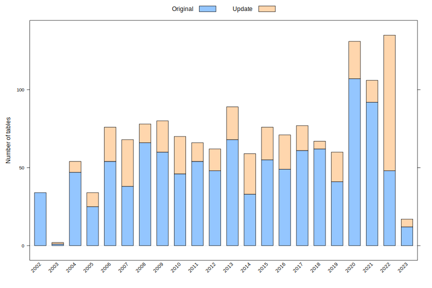
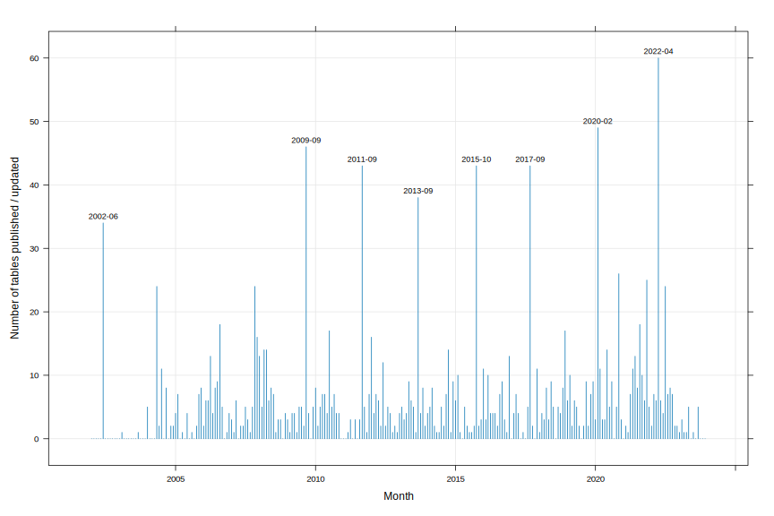

Frequency of NHANES releases
================
Deepayan Sarkar

# How often are NHANES data released / updated

``` r
library(nhanesA)
manifest <- nhanesManifest()
```

We want to tabulate when NHANES releases data. We expect that bulk
releases of tables happen all together, while some tables may be
released or updated on a as-needed basis.

The release information is available in the manifest as the
`Date.Published` field:

``` r
xtabs(~ Date.Published, manifest) |> sort() |> tail(20)
```

So let’s try to parse this systematically.

``` r
pubdate <- manifest$Date.Published
updates <- startsWith(pubdate, "Updated")
datesplit <- strsplit(pubdate, split = "[[:space:]]")
mismatch <- (sapply(datesplit, length) - updates) != 2L
if (any(mismatch)) {
    cat("Unexpected format:\n")
    print(manifest[mismatch, , drop = FALSE])
}
#> Unexpected format:
#>       Table DocURL DataURL     Years Date.Published
#> 1207 PAHS_H      #       # 2013-2014      Withdrawn
```

This currently flags one withdrawn table (PAHS_H). We will just skip
this and proceed.

``` r
pubdate <- pubdate[!mismatch]
updates <- updates[!mismatch]
datesplit <- datesplit[!mismatch]
datesplit[updates] <- lapply(datesplit[updates], "[", -1)
print(table(sapply(datesplit, length))) # should be all 2
#> 
#>    2 
#> 1512
pub_summary <-
    data.frame(updated = updates,
               year = sapply(datesplit, "[[", 2) |> as.numeric(),
               month = sapply(datesplit, "[[", 1) |> factor(levels = month.name))
```

Plot frequency by year:

``` r
xtabs(~ year + updated, pub_summary) |>
    barchart(horizontal = FALSE, ylab = "Number of tables",
             auto.key = list(text = c("Original", "Update"), columns = 2),
             scales = list(x = list(rot = 45)))
```



Table of frequency by month:

``` r
pubfreq <- xtabs(~ interaction(month, year, sep = "-") + updated, pub_summary)
pubfreq0 <- pubfreq[rowSums(pubfreq) > 0, , drop = FALSE]
pubfreq0
#>                                    updated
#> interaction(month, year, sep = "-") FALSE TRUE
#>                      June-2002         34    0
#>                      February-2003      0    1
#>                      September-2003     1    0
#>                      January-2004       5    0
#>                      May-2004          21    3
#>                      June-2004          2    0
#>                      July-2004         10    1
#>                      September-2004     5    3
#>                      November-2004      2    0
#>                      December-2004      2    0
#>                      January-2005       3    1
#>                      February-2005      5    2
#>                      April-2005         1    0
#>                      June-2005          1    3
#>                      August-2005        1    0
#>                      October-2005       0    2
#>                      November-2005      7    0
#>                      December-2005      7    1
#>                      January-2006       2    0
#>                      February-2006      6    0
#>                      March-2006         3    3
#>                      April-2006         7    6
#>                      May-2006           2    2
#>                      June-2006          6    2
#>                      July-2006          8    1
#>                      August-2006       11    7
#>                      September-2006     4    1
#>                      November-2006      1    0
#>                      December-2006      4    0
#>                      January-2007       1    2
#>                      February-2007      1    0
#>                      March-2007         1    5
#>                      May-2007           1    1
#>                      June-2007          0    2
#>                      July-2007          2    3
#>                      August-2007        0    3
#>                      September-2007     0    1
#>                      October-2007       2    3
#>                      November-2007     17    7
#>                      December-2007     13    3
#>                      January-2008      12    1
#>                      February-2008      4    1
#>                      March-2008        12    2
#>                      April-2008        12    2
#>                      May-2008           4    2
#>                      June-2008          5    3
#>                      July-2008          7    0
#>                      August-2008        1    0
#>                      September-2008     2    1
#>                      October-2008       3    0
#>                      December-2008      4    0
#>                      January-2009       2    1
#>                      February-2009      1    0
#>                      March-2009         4    0
#>                      April-2009         4    0
#>                      May-2009           1    0
#>                      June-2009          1    4
#>                      July-2009          0    5
#>                      August-2009        1    1
#>                      September-2009    41    5
#>                      October-2009       3    1
#>                      December-2009      2    3
#>                      January-2010       8    0
#>                      February-2010      1    1
#>                      March-2010         5    0
#>                      April-2010         2    5
#>                      May-2010           2    5
#>                      June-2010          3    1
#>                      July-2010         13    4
#>                      August-2010        3    2
#>                      September-2010     6    1
#>                      October-2010       1    3
#>                      November-2010      2    2
#>                      March-2011         0    1
#>                      April-2011         0    3
#>                      June-2011          3    0
#>                      August-2011        2    1
#>                      September-2011    37    6
#>                      October-2011       4    1
#>                      November-2011      1    0
#>                      December-2011      7    0
#>                      January-2012      11    5
#>                      February-2012      3    1
#>                      March-2012         1    6
#>                      April-2012         6    0
#>                      May-2012           2    0
#>                      June-2012         12    0
#>                      July-2012          2    0
#>                      August-2012        4    1
#>                      September-2012     3    1
#>                      October-2012       1    0
#>                      November-2012      2    0
#>                      December-2012      1    0
#>                      January-2013       3    1
#>                      February-2013      4    1
#>                      March-2013         2    1
#>                      April-2013         2    2
#>                      May-2013           0    9
#>                      June-2013          3    3
#>                      July-2013          5    0
#>                      August-2013        0    1
#>                      September-2013    38    0
#>                      October-2013       2    2
#>                      November-2013      8    0
#>                      December-2013      1    1
#>                      January-2014       4    0
#>                      February-2014      3    2
#>                      March-2014         7    1
#>                      April-2014         1    1
#>                      May-2014           0    1
#>                      June-2014          1    0
#>                      July-2014          4    1
#>                      August-2014        1    1
#>                      September-2014     6    1
#>                      October-2014       0   14
#>                      November-2014      1    0
#>                      December-2014      5    4
#>                      January-2015       4    2
#>                      February-2015      4    6
#>                      March-2015         1    0
#>                      May-2015           0    5
#>                      June-2015          0    2
#>                      July-2015          1    0
#>                      August-2015        1    0
#>                      September-2015     1    1
#>                      October-2015      38    5
#>                      November-2015      2    0
#>                      December-2015      3    0
#>                      January-2016      10    1
#>                      February-2016      3    0
#>                      March-2016         7    3
#>                      April-2016         4    0
#>                      May-2016           3    1
#>                      June-2016          4    0
#>                      July-2016          2    0
#>                      August-2016        4    3
#>                      September-2016     5    4
#>                      October-2016       1    2
#>                      November-2016      0    1
#>                      December-2016      6    7
#>                      February-2017      3    1
#>                      March-2017         4    3
#>                      April-2017         4    0
#>                      June-2017          1    0
#>                      August-2017        1    4
#>                      September-2017    40    3
#>                      October-2017       2    0
#>                      December-2017      6    5
#>                      January-2018       1    0
#>                      February-2018      3    1
#>                      March-2018         3    0
#>                      April-2018         5    3
#>                      May-2018           3    0
#>                      June-2018          9    0
#>                      July-2018          5    0
#>                      September-2018     5    0
#>                      October-2018       4    0
#>                      November-2018      7    1
#>                      December-2018     17    0
#>                      January-2019       6    0
#>                      February-2019      4    6
#>                      March-2019         0    2
#>                      April-2019         5    1
#>                      May-2019           5    0
#>                      June-2019          1    1
#>                      August-2019        2    0
#>                      September-2019     9    0
#>                      October-2019       0    2
#>                      November-2019      3    4
#>                      December-2019      6    3
#>                      January-2020       2    1
#>                      February-2020     48    1
#>                      March-2020        11    0
#>                      April-2020         2    1
#>                      May-2020           3    0
#>                      June-2020         13    1
#>                      July-2020          5    0
#>                      August-2020        8    1
#>                      October-2020       5    0
#>                      November-2020      7   19
#>                      December-2020      3    0
#>                      February-2021      1    1
#>                      March-2021         0    1
#>                      April-2021         7    0
#>                      May-2021          10    1
#>                      June-2021         12    1
#>                      July-2021          8    0
#>                      August-2021       17    1
#>                      September-2021     9    1
#>                      October-2021       6    0
#>                      November-2021     18    7
#>                      December-2021      4    1
#>                      January-2022       2    0
#>                      February-2022      1    6
#>                      March-2022         6    0
#>                      April-2022         1   59
#>                      May-2022           1    5
#>                      June-2022          4    0
#>                      July-2022         15    9
#>                      August-2022        5    2
#>                      September-2022     8    0
#>                      October-2022       3    4
#>                      November-2022      2    0
#>                      December-2022      0    2
#>                      January-2023       1    0
#>                      February-2023      3    0
#>                      March-2023         1    0
#>                      April-2023         1    0
#>                      May-2023           2    3
#>                      July-2023          1    0
#>                      September-2023     3    2
```

There are a bit too many months to plot nicely, but approximately:

``` r
npub <- rowSums(pubfreq)
npub.date <- as.Date(paste0("01", "-", names(npub)), format = "%d-%B-%Y")
xyplot(npub ~ npub.date, type = "h", grid = TRUE,
       xlab = "Month", ylab = "Number of tables published / updated") +
    latticeExtra::layer(panel.text(x[y > 30], y[y > 30],
                                   format(x[y > 30], "%Y-%m"),
                                   pos = 3, cex = 0.75))
```


